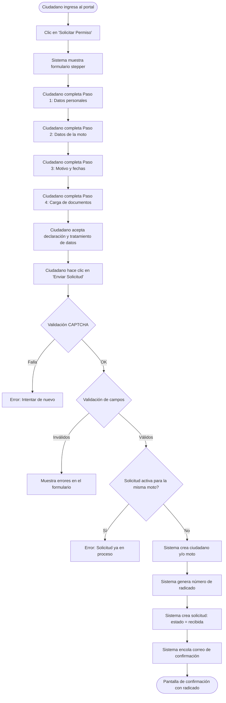
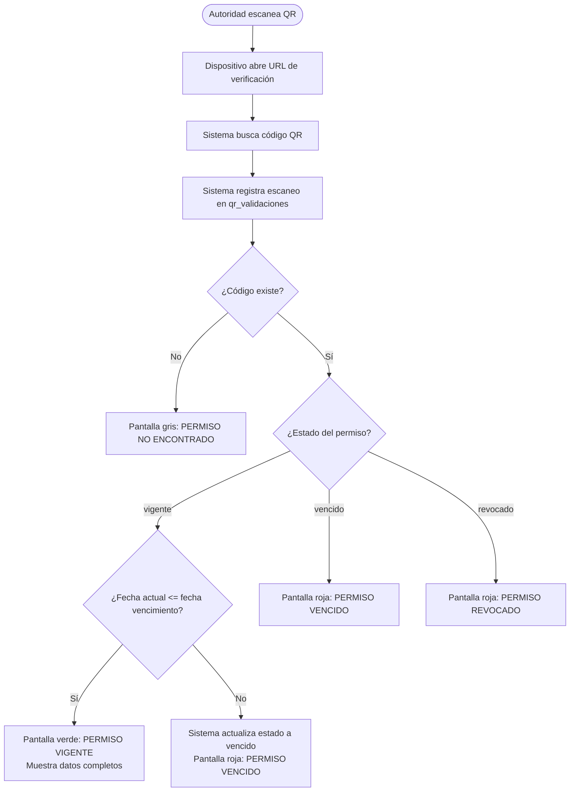
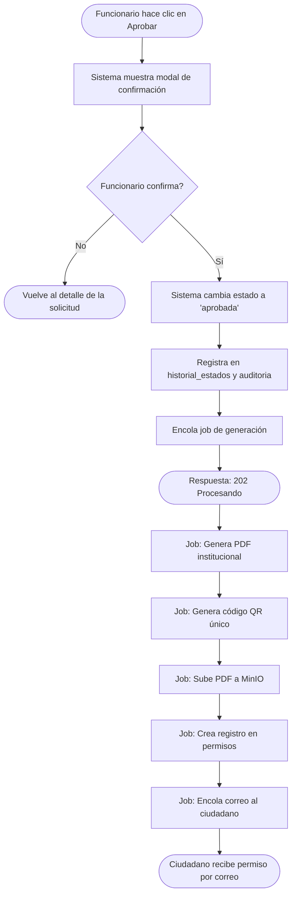
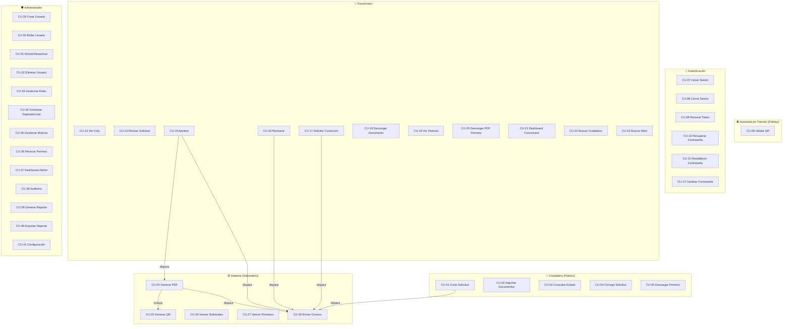
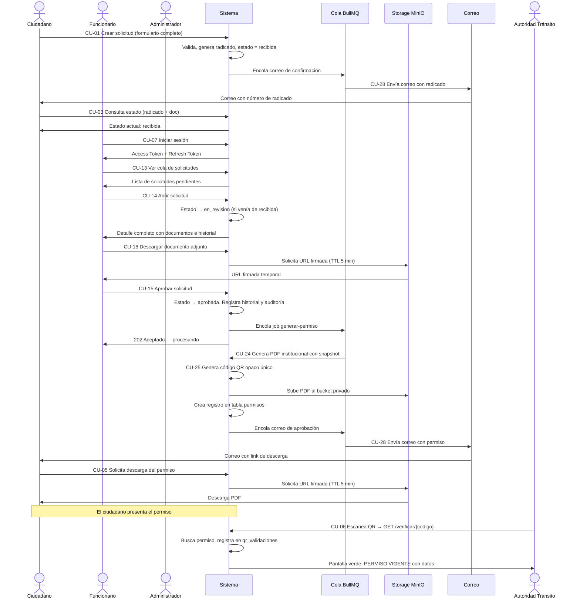

# Casos de Uso — Sistema de Permisos de Circulación (Pico y Placa)

**Versión:** 1.0  
**Fecha:** 2026-08-02  
**Referencia:** `docs/PRD_Sistema_Permisos_de_Circulacion.md` · `docs/API_FUNCIONAL.md` · `docs/MODELO_DATOS.md`

---

## Índice

### Actores del Sistema
- [Definición de Actores](#actores-del-sistema-1)

### Módulo 1 — Ciudadano (Acceso Público)
- [CU-01 Crear Solicitud de Permiso](#cu-01-crear-solicitud-de-permiso)
- [CU-02 Adjuntar Documentos a la Solicitud](#cu-02-adjuntar-documentos-a-la-solicitud)
- [CU-03 Consultar Estado de la Solicitud](#cu-03-consultar-estado-de-la-solicitud)
- [CU-04 Corregir Solicitud](#cu-04-corregir-solicitud)
- [CU-05 Descargar Permiso Aprobado](#cu-05-descargar-permiso-aprobado)
- [CU-06 Validar Permiso por Código QR](#cu-06-validar-permiso-por-código-qr)

### Módulo 2 — Autenticación
- [CU-07 Iniciar Sesión](#cu-07-iniciar-sesión)
- [CU-08 Cerrar Sesión](#cu-08-cerrar-sesión)
- [CU-09 Renovar Token de Sesión](#cu-09-renovar-token-de-sesión)
- [CU-10 Recuperar Contraseña](#cu-10-recuperar-contraseña)
- [CU-11 Restablecer Contraseña](#cu-11-restablecer-contraseña)
- [CU-12 Cambiar Contraseña](#cu-12-cambiar-contraseña)

### Módulo 3 — Funcionario
- [CU-13 Ver Cola de Solicitudes](#cu-13-ver-cola-de-solicitudes)
- [CU-14 Revisar Solicitud](#cu-14-revisar-solicitud)
- [CU-15 Aprobar Solicitud](#cu-15-aprobar-solicitud)
- [CU-16 Rechazar Solicitud](#cu-16-rechazar-solicitud)
- [CU-17 Solicitar Corrección al Ciudadano](#cu-17-solicitar-corrección-al-ciudadano)
- [CU-18 Descargar Documento Adjunto](#cu-18-descargar-documento-adjunto)
- [CU-19 Ver Historial de Estados de una Solicitud](#cu-19-ver-historial-de-estados-de-una-solicitud)
- [CU-20 Descargar PDF del Permiso](#cu-20-descargar-pdf-del-permiso)
- [CU-21 Ver Dashboard del Funcionario](#cu-21-ver-dashboard-del-funcionario)
- [CU-22 Buscar Ciudadano](#cu-22-buscar-ciudadano)
- [CU-23 Buscar Motocicleta por Placa](#cu-23-buscar-motocicleta-por-placa)

### Módulo 4 — Generación Automática del Permiso (Sistema)
- [CU-24 Generar Permiso PDF](#cu-24-generar-permiso-pdf)
- [CU-25 Generar Código QR](#cu-25-generar-código-qr)
- [CU-26 Marcar Solicitudes Vencidas](#cu-26-marcar-solicitudes-vencidas)
- [CU-27 Marcar Permisos Vencidos](#cu-27-marcar-permisos-vencidos)
- [CU-28 Enviar Notificaciones por Correo](#cu-28-enviar-notificaciones-por-correo)

### Módulo 5 — Administrador
- [CU-29 Crear Usuario Funcionario](#cu-29-crear-usuario-funcionario)
- [CU-30 Editar Usuario](#cu-30-editar-usuario)
- [CU-31 Activar o Desactivar Usuario](#cu-31-activar-o-desactivar-usuario)
- [CU-32 Eliminar Usuario](#cu-32-eliminar-usuario)
- [CU-33 Gestionar Roles](#cu-33-gestionar-roles)
- [CU-34 Gestionar Dependencias](#cu-34-gestionar-dependencias)
- [CU-35 Gestionar Motivos de Solicitud](#cu-35-gestionar-motivos-de-solicitud)
- [CU-36 Revocar Permiso](#cu-36-revocar-permiso)
- [CU-37 Ver Dashboard Administrativo](#cu-37-ver-dashboard-administrativo)
- [CU-38 Consultar Bitácora de Auditoría](#cu-38-consultar-bitácora-de-auditoría)
- [CU-39 Generar Reporte](#cu-39-generar-reporte)
- [CU-40 Exportar Reporte](#cu-40-exportar-reporte)
- [CU-41 Gestionar Configuración del Sistema](#cu-41-gestionar-configuración-del-sistema)

### Diagrama General
- [Diagrama de Casos de Uso por Actor](#diagrama-de-casos-de-uso-por-actor)
- [Diagrama del Flujo Principal](#diagrama-del-flujo-principal)

---

## Actores del Sistema

| Actor | Tipo | Descripción | Autenticación |
|-------|------|-------------|---------------|
| **Ciudadano** | Primario | Persona natural que solicita el permiso de circulación | Sin login. Se identifica con radicado + número de documento |
| **Funcionario** | Primario | Servidor público de la alcaldía que revisa y gestiona solicitudes | JWT (usuario y contraseña) |
| **Administrador** | Primario | Servidor público con control total del sistema | JWT (usuario y contraseña) + rol `administrador` |
| **Autoridad de Tránsito** | Secundario | Agente que verifica la autenticidad del permiso en campo | Sin login. Accede vía QR a página pública |
| **Sistema** | Interno | Componente automatizado que ejecuta jobs programados y colas | Sin actor humano |

---

## Módulo 1 — Ciudadano (Acceso Público)

---

### CU-01 Crear Solicitud de Permiso

| Campo | Descripción |
|-------|-------------|
| **ID** | CU-01 |
| **Nombre** | Crear Solicitud de Permiso de Circulación |
| **Actor principal** | Ciudadano |
| **Actores secundarios** | Sistema |
| **Prioridad** | Alta — Es el flujo principal del sistema |
| **Precondiciones** | El ciudadano tiene acceso a internet y al portal web |
| **Postcondiciones** | La solicitud queda registrada con estado `recibida` y el ciudadano recibe su número de radicado por correo |

**Flujo Principal:**

1. El ciudadano ingresa al portal web de la alcaldía.
2. El sistema muestra la página de inicio con el botón "Solicitar Permiso de Pico y Placa".
3. El ciudadano hace clic en "Solicitar Permiso".
4. El sistema presenta el formulario en pasos (stepper):
   - **Paso 1 — Datos personales:** tipo de documento, número de documento, nombre, apellido, fecha de nacimiento, dirección, barrio, municipio, celular, correo electrónico.
   - **Paso 2 — Datos de la motocicleta:** placa, marca, línea, modelo, cilindraje, color, número de motor, número de chasis.
   - **Paso 3 — Motivo y fechas:** motivo (lista desplegable), fecha de inicio, fecha de fin, descripción adicional.
   - **Paso 4 — Documentos:** carga de archivos (cédula, licencia de conducción, licencia de tránsito, SOAT, RTM, carta laboral, otros).
   - **Paso 5 — Confirmación:** resumen, declaración jurada, casilla de autorización de tratamiento de datos, CAPTCHA.
5. El ciudadano completa todos los pasos y hace clic en "Enviar Solicitud".
6. El sistema valida el token reCAPTCHA.
7. El sistema valida todos los campos del formulario.
8. El sistema verifica que no exista una solicitud activa para la misma motocicleta (RN-03).
9. El sistema crea o actualiza el registro del ciudadano.
10. El sistema crea o vincula el registro de la motocicleta.
11. El sistema genera el número de radicado con formato `AAAAMMDD-PYP-XXXXXX`.
12. El sistema crea la solicitud con estado `recibida`.
13. El sistema encola la notificación de correo al ciudadano con el número de radicado.
14. El sistema muestra la pantalla de confirmación con el número de radicado de forma prominente e instrucciones para hacer seguimiento.

**Flujos Alternativos:**

- **FA-01A — El ciudadano ya tiene una solicitud activa para la misma moto:**  
  En el paso 8, el sistema detecta conflicto y muestra el mensaje: *"La motocicleta [PLACA] ya tiene una solicitud en proceso con radicado [RADICADO]. No puede crear una nueva hasta que la anterior sea resuelta."* El flujo termina.

- **FA-01B — El CAPTCHA falla (score < 0.5):**  
  El sistema rechaza la solicitud con un mensaje genérico de error y solicita intentarlo de nuevo.

- **FA-01C — El ciudadano cierra el navegador antes de enviar:**  
  El sistema conservó los datos ingresados en `localStorage`. Al regresar al formulario, los datos se restauran automáticamente.

- **FA-01D — El motivo seleccionado requiere soporte documental:**  
  En el paso 4, el sistema resalta en rojo los tipos de documento obligatorios para ese motivo (ej: carta laboral para "Trabajo").

**Flujos de Excepción:**

- **FE-01A — Error en el servidor al guardar:**  
  El sistema muestra un mensaje de error genérico y sugiere intentar más tarde. La solicitud no queda a medias.

**Reglas de Negocio Aplicadas:**

| Regla | Descripción |
|-------|-------------|
| RN-01 | La fecha de inicio no puede ser anterior a hoy |
| RN-02 | La fecha de fin no puede superar `dias_max_permiso` días desde la fecha de inicio |
| RN-03 | No puede existir solicitud activa para la misma moto |
| RN-13 | Fecha y hora se almacenan en UTC |
| RN-14 | Formato de radicado: `AAAAMMDD-PYP-XXXXXX` |
| Ley 1581 | `acepta_tratamiento_datos = true` es obligatorio |

**Validaciones de Campos:**

| Campo | Regla |
|-------|-------|
| `tipoDocumento` | Valores: CC, CE, PAS, TI, NIT |
| `numeroDocumento` | Solo dígitos, 5–20 caracteres |
| `nombre` / `apellido` | 2–100 caracteres, sin dígitos |
| `email` | Formato de correo válido |
| `celular` | 10 dígitos, puede iniciar con 3 |
| `placa` | Formato colombiano: `AAA000` o `AAA00A` |
| `fechaInicio` | Fecha futura o igual a hoy |
| `fechaFin` | Mayor o igual a `fechaInicio` |
| `declaracionJurada` | Obligatoriamente `true` |
| Adjuntos | PDF, JPG o PNG. Máximo 10 MB por archivo |

**Diagrama de Flujo:**

---

### CU-02 Adjuntar Documentos a la Solicitud

| Campo | Descripción |
|-------|-------------|
| **ID** | CU-02 |
| **Nombre** | Adjuntar Documentos de Soporte a una Solicitud |
| **Actor principal** | Ciudadano |
| **Prioridad** | Alta |
| **Precondiciones** | La solicitud existe y está en estado `recibida` o `pendiente_correccion`. El ciudadano conoce su número de radicado y número de documento |
| **Postcondiciones** | El documento queda almacenado de forma segura y asociado a la solicitud |

**Flujo Principal:**

1. El ciudadano accede a la página de su solicitud con radicado + número de documento.
2. El sistema verifica la identidad por radicado + documento.
3. El sistema verifica que la solicitud está en estado `recibida` o `pendiente_correccion`.
4. El ciudadano selecciona el tipo de documento y adjunta el archivo.
5. El sistema valida el formato (PDF, JPG, PNG) y el tamaño (máx. 10 MB).
6. El sistema calcula el hash SHA-256 del archivo.
7. El sistema sube el archivo al bucket de storage con nombre UUID.
8. El sistema registra el documento en la tabla `documentos`.
9. El sistema confirma la carga exitosa mostrando el nombre del archivo y tipo.

**Flujos Alternativos:**

- **FA-02A — Archivo de formato no permitido:**  
  El sistema rechaza el archivo y muestra: *"Solo se permiten archivos PDF, JPG y PNG."*

- **FA-02B — Archivo mayor a 10 MB:**  
  El sistema rechaza y muestra: *"El archivo supera el tamaño máximo permitido de 10 MB."*

- **FA-02C — La solicitud está en estado diferente:**  
  El sistema retorna error 422 con mensaje: *"No puede adjuntar documentos en el estado actual de la solicitud."*

- **FA-02D — Ciudadano reemplaza un documento previo:**  
  El sistema marca el documento anterior como `activo = false` y sube el nuevo. El documento anterior se conserva para trazabilidad.

**Reglas de Negocio:**
- Solo el ciudadano propietario puede adjuntar documentos (validado por radicado + número de documento).
- Los documentos nunca se eliminan físicamente del storage, incluso si la solicitud es rechazada (RN-09).

---

### CU-03 Consultar Estado de la Solicitud

| Campo | Descripción |
|-------|-------------|
| **ID** | CU-03 |
| **Nombre** | Consultar Estado de una Solicitud por Radicado |
| **Actor principal** | Ciudadano |
| **Prioridad** | Alta |
| **Precondiciones** | El ciudadano tiene su número de radicado y número de documento |
| **Postcondiciones** | El ciudadano visualiza el estado actual y, si aplica, los campos a corregir o el enlace de descarga del permiso |

**Flujo Principal:**

1. El ciudadano accede a la página "Consultar mi solicitud".
2. El ciudadano ingresa su número de radicado y número de documento.
3. El sistema valida que ambos datos correspondan a la misma solicitud.
4. El sistema retorna el estado actual con descripción en lenguaje ciudadano:

| Estado interno | Mensaje al ciudadano |
|----------------|---------------------|
| `recibida` | *"Su solicitud fue recibida y está en espera de revisión."* |
| `en_revision` | *"Su solicitud está siendo revisada por un funcionario."* |
| `pendiente_correccion` | *"El funcionario requiere que corrija algunos datos. Vea las instrucciones abajo."* |
| `aprobada` | *"¡Su solicitud fue aprobada! Puede descargar su permiso."* |
| `rechazada` | *"Su solicitud fue rechazada. [Motivo del rechazo]."* |
| `vencida` | *"Su solicitud venció sin ser procesada. Puede crear una nueva solicitud."* |

5. Si el estado es `pendiente_correccion`, el sistema muestra los campos específicos que el funcionario solicitó corregir.
6. Si el estado es `aprobada`, el sistema muestra el botón de descarga del permiso.
7. Si el permiso está `revocado` o `vencido`, el sistema informa el estado con mensaje claro.

**Flujos Alternativos:**

- **FA-03A — Radicado no encontrado o documento no coincide:**  
  El sistema muestra: *"No encontramos ninguna solicitud con esos datos. Verifique su número de radicado y documento."* — Respuesta idéntica en ambos casos para evitar enumeración.

**Reglas de Seguridad:**
- Rate limiting: 10 consultas por IP por minuto.
- La respuesta no distingue entre "radicado no existe" y "documento incorrecto" (prevención de enumeración).

---

### CU-04 Corregir Solicitud

| Campo | Descripción |
|-------|-------------|
| **ID** | CU-04 |
| **Nombre** | Corregir Solicitud en Estado Pendiente de Corrección |
| **Actor principal** | Ciudadano |
| **Prioridad** | Alta |
| **Precondiciones** | La solicitud está en estado `pendiente_correccion`. El ciudadano recibió el correo con los campos a corregir |
| **Postcondiciones** | La solicitud regresa a estado `recibida` y el funcionario puede revisarla de nuevo |

**Flujo Principal:**

1. El ciudadano accede a su solicitud con radicado + número de documento.
2. El sistema muestra el listado de correcciones solicitadas por el funcionario con descripción específica de cada una.
3. El ciudadano realiza las correcciones:
   - Si es un documento: adjunta el nuevo archivo (CU-02).
   - Si es un dato textual: el sistema muestra los campos editables específicos.
4. El ciudadano hace clic en "Enviar Correcciones".
5. El sistema valida los nuevos datos y documentos.
6. El sistema registra el cambio de estado a `recibida` en `historial_estados`.
7. El sistema notifica al funcionario que la solicitud fue corregida y está disponible.
8. El sistema muestra confirmación al ciudadano.

**Flujos Alternativos:**

- **FA-04A — El plazo de corrección venció:**  
  El sistema muestra: *"El plazo para corregir esta solicitud ha vencido. Debe crear una nueva solicitud."* La solicitud ya está en estado `vencida`.

**Reglas de Negocio:**
- El plazo de corrección es configurable (`plazo_correccion_dias`, default 5 días hábiles) (RN-11).
- Solo los campos señalados por el funcionario son editables; el resto quedan bloqueados.

---

### CU-05 Descargar Permiso Aprobado

| Campo | Descripción |
|-------|-------------|
| **ID** | CU-05 |
| **Nombre** | Descargar el Permiso de Circulación Aprobado |
| **Actor principal** | Ciudadano |
| **Prioridad** | Alta |
| **Precondiciones** | La solicitud tiene estado `aprobada` y el permiso fue generado correctamente. El ciudadano tiene su radicado y número de documento |
| **Postcondiciones** | El ciudadano descarga el PDF institucional del permiso |

**Flujo Principal:**

1. El ciudadano consulta el estado de su solicitud (CU-03) y el sistema muestra estado `aprobada`.
2. El sistema presenta el botón "Descargar Permiso".
3. El ciudadano hace clic en el botón.
4. El sistema verifica la identidad (radicado + documento).
5. El sistema verifica que el permiso está en estado `vigente`.
6. El sistema genera una URL firmada temporal (TTL: 5 minutos) para el PDF en storage.
7. El ciudadano descarga el PDF.

**Flujos Alternativos:**

- **FA-05A — El permiso está vencido:**  
  El sistema informa: *"Su permiso venció el [fecha]. Puede crear una nueva solicitud si necesita un nuevo permiso."*

- **FA-05B — El permiso fue revocado:**  
  El sistema informa: *"Su permiso fue revocado por la autoridad competente. Comuníquese con la alcaldía para más información."*

---

### CU-06 Validar Permiso por Código QR

| Campo | Descripción |
|-------|-------------|
| **ID** | CU-06 |
| **Nombre** | Validar la Autenticidad de un Permiso Escaneando el Código QR |
| **Actor principal** | Autoridad de Tránsito |
| **Actores secundarios** | Sistema |
| **Prioridad** | Alta — Funcionalidad crítica para el cumplimiento del propósito del sistema |
| **Precondiciones** | La autoridad tiene un dispositivo con cámara y acceso a internet. El ciudadano presenta el permiso físico o digital |
| **Postcondiciones** | La autoridad conoce el estado real y actualizado del permiso en tiempo real |

**Flujo Principal:**

1. La autoridad de tránsito escanea el código QR del permiso con su dispositivo móvil.
2. El dispositivo abre automáticamente la URL de verificación: `https://dominio.gov.co/verificar/{codigoOpaco}`.
3. El sistema recibe la consulta y busca el código QR en la tabla `permisos`.
4. El sistema registra el escaneo en `qr_validaciones` (IP, user_agent, fecha, resultado).
5. El sistema retorna y el navegador presenta la página de validación optimizada para móvil.

**Flujos Alternativos — según resultado:**

- **FA-06A — Permiso VIGENTE:**  
  Pantalla verde con ✅ y datos: nombre del titular, tipo y número de documento, placa, marca, modelo, color, motivo autorizado, fechas de expedición y vencimiento, funcionario que autorizó.

- **FA-06B — Permiso VENCIDO:**  
  Pantalla roja con ❌ y mensaje: *"PERMISO VENCIDO — Este permiso venció el [fecha] y ya no es válido para circular."*

- **FA-06C — Permiso REVOCADO:**  
  Pantalla roja con ❌ y mensaje: *"PERMISO REVOCADO — Este permiso fue anulado por la autoridad competente."*

- **FA-06D — Código QR no encontrado:**  
  Pantalla gris con ⚠️ y mensaje: *"PERMISO NO ENCONTRADO — El código escaneado no corresponde a ningún permiso registrado."*

**Reglas de Seguridad:**
- El código QR es un identificador opaco (UUID + hash). No contiene datos personales.
- Rate limiting: 30 consultas por IP por minuto.
- La página de validación no requiere autenticación.
- Todos los casos retornan HTTP 200; el resultado se comunica en el body (evita filtración de info por status HTTP).

**Diagrama de Flujo:**

---

## Módulo 2 — Autenticación

---

### CU-07 Iniciar Sesión

| Campo | Descripción |
|-------|-------------|
| **ID** | CU-07 |
| **Nombre** | Iniciar Sesión en el Sistema |
| **Actor principal** | Funcionario / Administrador |
| **Prioridad** | Alta |
| **Precondiciones** | El usuario tiene una cuenta activa en el sistema con contraseña no vencida |
| **Postcondiciones** | El usuario recibe un access token (15 min) y un refresh token (7 días) y accede al panel |

**Flujo Principal:**

1. El usuario accede a la URL del panel interno.
2. El sistema presenta la pantalla de login.
3. El usuario ingresa su correo electrónico y contraseña.
4. El usuario hace clic en "Ingresar".
5. El sistema verifica que la cuenta existe y está activa.
6. El sistema verifica que la cuenta no está bloqueada (`bloqueado_hasta < NOW()`).
7. El sistema valida la contraseña con BCrypt.
8. El sistema emite el access token JWT (TTL: 15 min) y el refresh token (TTL: 7 días).
9. El sistema resetea `intentos_fallidos = 0` y actualiza `ultimo_login`.
10. El sistema registra el evento `login` en `auditoria`.
11. El sistema redirige al panel según el rol: panel de funcionario o panel de administrador.

**Flujos Alternativos:**

- **FA-07A — Credenciales incorrectas (intentos < 5):**  
  El sistema incrementa `intentos_fallidos` en 1. Muestra: *"Correo o contraseña incorrectos."* Registra `login_fallido` en `auditoria`.

- **FA-07B — Credenciales incorrectas (intento número 5):**  
  El sistema establece `bloqueado_hasta = NOW() + 30 minutos`. Muestra: *"Cuenta bloqueada por 30 minutos debido a múltiples intentos fallidos."*

- **FA-07C — Cuenta bloqueada temporalmente:**  
  El sistema retorna: *"Su cuenta está bloqueada temporalmente. Intente en [tiempo restante]."*

- **FA-07D — Cuenta desactivada:**  
  El sistema retorna: *"Su cuenta no está activa. Comuníquese con el administrador."*

- **FA-07E — Contraseña vencida (90 días):**  
  El sistema emite un token temporal de cambio y redirige a la pantalla de cambio de contraseña obligatorio antes de permitir el acceso.

**Reglas de Seguridad:**
- Rate limiting: 5 intentos por IP en 15 minutos.
- La contraseña nunca se almacena en texto plano.
- El mensaje de error no distingue si el correo existe o si la contraseña es incorrecta (prevención de enumeración de cuentas).

---

### CU-08 Cerrar Sesión

| Campo | Descripción |
|-------|-------------|
| **ID** | CU-08 |
| **Nombre** | Cerrar Sesión del Sistema |
| **Actor principal** | Funcionario / Administrador |
| **Prioridad** | Media |
| **Precondiciones** | El usuario tiene una sesión activa |
| **Postcondiciones** | El refresh token queda revocado. La próxima solicitud con el access token vencido no podrá renovarse |

**Flujo Principal:**

1. El usuario hace clic en "Cerrar Sesión" en el panel.
2. El sistema revoca el refresh token activo (`revocado = true`, `revocado_at = NOW()`).
3. El sistema registra el evento `logout` en `auditoria`.
4. El sistema elimina los tokens del almacenamiento del cliente.
5. El sistema redirige a la pantalla de login.

---

### CU-09 Renovar Token de Sesión

| Campo | Descripción |
|-------|-------------|
| **ID** | CU-09 |
| **Nombre** | Renovar el Access Token usando el Refresh Token |
| **Actor principal** | Sistema (llamada automática del frontend) |
| **Prioridad** | Alta |
| **Precondiciones** | El access token venció. El refresh token es válido, no está revocado y no venció |
| **Postcondiciones** | Se emite un nuevo access token y un nuevo refresh token. El refresh token anterior queda revocado |

**Flujo Principal:**

1. El frontend detecta respuesta 401 con código `TOKEN_EXPIRED`.
2. El frontend envía automáticamente el refresh token al endpoint `/auth/refresh`.
3. El sistema valida el refresh token (hash, vigencia, no revocado).
4. El sistema revoca el refresh token actual.
5. El sistema emite un nuevo access token y un nuevo refresh token.
6. El frontend reanuda la solicitud original con el nuevo access token.

**Flujos Alternativos:**

- **FA-09A — Refresh token inválido o revocado:**  
  El sistema retorna 401. El frontend redirige al login. Este escenario puede indicar uso concurrente del token (posible robo de sesión).

---

### CU-10 Recuperar Contraseña

| Campo | Descripción |
|-------|-------------|
| **ID** | CU-10 |
| **Nombre** | Solicitar Recuperación de Contraseña Olvidada |
| **Actor principal** | Funcionario / Administrador |
| **Prioridad** | Media |
| **Precondiciones** | El usuario conoce el correo con el que está registrado |
| **Postcondiciones** | Se envía un correo con enlace de recuperación válido por 1 hora |

**Flujo Principal:**

1. El usuario hace clic en "¿Olvidó su contraseña?" en la pantalla de login.
2. El sistema presenta el formulario con campo de correo electrónico.
3. El usuario ingresa su correo y hace clic en "Enviar".
4. El sistema busca el usuario por correo.
5. Si el usuario existe y está activo, el sistema genera un token de recuperación (hash aleatorio), lo almacena en la tabla `tokens` con `tipo = 'reset_contrasena'` y TTL de 1 hora.
6. El sistema encola el correo con el enlace de recuperación.
7. El sistema muestra el mensaje: *"Si el correo está registrado, recibirá un enlace de recuperación en los próximos minutos."*

**Reglas de Seguridad:**
- La respuesta es idéntica exista o no el correo (prevención de enumeración de cuentas).
- Rate limiting: 3 intentos por IP por hora.

---

### CU-11 Restablecer Contraseña

| Campo | Descripción |
|-------|-------------|
| **ID** | CU-11 |
| **Nombre** | Restablecer Contraseña con Token de Recuperación |
| **Actor principal** | Funcionario / Administrador |
| **Prioridad** | Media |
| **Precondiciones** | El usuario tiene el enlace de recuperación válido (< 1 hora desde que fue emitido) |
| **Postcondiciones** | La contraseña queda actualizada. Todas las sesiones activas quedan revocadas |

**Flujo Principal:**

1. El usuario hace clic en el enlace del correo de recuperación.
2. El sistema valida el token (existe, no fue usado, no venció).
3. El sistema presenta el formulario de nueva contraseña (campo + confirmación).
4. El usuario ingresa la nueva contraseña dos veces.
5. El sistema valida la política de contraseñas (longitud, caracteres requeridos).
6. El sistema verifica que la nueva contraseña no esté en el historial de las últimas 5.
7. El sistema actualiza `contrasena_hash` con BCrypt (12 rounds).
8. El sistema revoca el token de recuperación.
9. El sistema revoca todos los refresh tokens activos del usuario.
10. El sistema registra `cambiar_contrasena` en `auditoria`.
11. El sistema muestra: *"Contraseña restablecida correctamente. Puede iniciar sesión."*

**Flujos Alternativos:**

- **FA-11A — Token vencido:**  
  El sistema retorna: *"El enlace de recuperación ha expirado. Solicite uno nuevo."*

- **FA-11B — Contraseña en el historial:**  
  El sistema retorna: *"No puede usar una de sus últimas 5 contraseñas. Elija una diferente."*

---

### CU-12 Cambiar Contraseña

| Campo | Descripción |
|-------|-------------|
| **ID** | CU-12 |
| **Nombre** | Cambiar Contraseña Estando Autenticado |
| **Actor principal** | Funcionario / Administrador |
| **Prioridad** | Media |
| **Precondiciones** | El usuario tiene una sesión activa |
| **Postcondiciones** | La contraseña queda actualizada. Todas las sesiones activas quedan revocadas (fuerza nuevo login) |

**Flujo Principal:**

1. El usuario accede a "Cambiar contraseña" en su perfil.
2. El sistema presenta el formulario: contraseña actual, nueva contraseña, confirmar nueva contraseña.
3. El usuario completa el formulario.
4. El sistema valida que la contraseña actual sea correcta.
5. El sistema valida la política de la nueva contraseña.
6. El sistema valida que no esté en el historial de las últimas 5.
7. El sistema actualiza la contraseña y el historial.
8. El sistema revoca todos los refresh tokens del usuario.
9. El sistema registra `cambiar_contrasena` en `auditoria`.
10. El sistema redirige al login con mensaje: *"Contraseña actualizada. Inicie sesión con la nueva contraseña."*

---

## Módulo 3 — Funcionario

---

### CU-13 Ver Cola de Solicitudes

| Campo | Descripción |
|-------|-------------|
| **ID** | CU-13 |
| **Nombre** | Ver la Cola de Solicitudes Pendientes |
| **Actor principal** | Funcionario |
| **Prioridad** | Alta |
| **Precondiciones** | El funcionario tiene sesión activa |
| **Postcondiciones** | El funcionario visualiza las solicitudes pendientes ordenadas por antigüedad |

**Flujo Principal:**

1. El funcionario accede al panel y la vista predeterminada muestra la cola de trabajo.
2. El sistema carga las solicitudes en estado `recibida`, `en_revision` y `pendiente_correccion`.
3. El sistema las ordena por `created_at ASC` (las más antiguas primero — principio FIFO).
4. El sistema muestra tarjetas con: número de radicado, nombre del ciudadano, placa, motivo, fecha de solicitud, tiempo de espera.
5. El sistema resalta con color rojo las solicitudes que llevan más de 24 horas sin atención.
6. El funcionario puede aplicar filtros: estado, fecha, documento, placa, radicado.
7. El funcionario puede hacer clic en una solicitud para revisarla (CU-14).

---

### CU-14 Revisar Solicitud

| Campo | Descripción |
|-------|-------------|
| **ID** | CU-14 |
| **Nombre** | Abrir y Revisar el Detalle de una Solicitud |
| **Actor principal** | Funcionario |
| **Prioridad** | Alta |
| **Precondiciones** | La solicitud existe y está en estado `recibida` o `pendiente_correccion`. El funcionario tiene sesión activa |
| **Postcondiciones** | La solicitud pasa a estado `en_revision`. El funcionario puede ver todos los datos y documentos |

**Flujo Principal:**

1. El funcionario hace clic en una solicitud de la cola (CU-13).
2. El sistema cambia el estado de la solicitud a `en_revision` (si estaba en `recibida`).
3. El sistema registra el cambio en `historial_estados` y `auditoria`.
4. El sistema presenta la vista de detalle con:
   - Datos completos del ciudadano.
   - Datos completos de la motocicleta.
   - Motivo y descripción adicional.
   - Fechas solicitadas.
   - Lista de documentos adjuntos con botones de previsualización.
   - Historial de estados previos.
5. El funcionario revisa toda la información y los documentos (CU-18).
6. El funcionario decide la acción: aprobar (CU-15), rechazar (CU-16) o solicitar corrección (CU-17).

**Regla:** Si la solicitud ya estaba en `en_revision` o `pendiente_correccion`, el estado no cambia al abrir. Solo cambia `recibida` → `en_revision`.

---

### CU-15 Aprobar Solicitud

| Campo | Descripción |
|-------|-------------|
| **ID** | CU-15 |
| **Nombre** | Aprobar una Solicitud y Generar el Permiso |
| **Actor principal** | Funcionario |
| **Actores secundarios** | Sistema |
| **Prioridad** | Alta — Es el flujo feliz del sistema |
| **Precondiciones** | La solicitud está en estado `en_revision`. El funcionario revisó toda la información |
| **Postcondiciones** | La solicitud queda en estado `aprobada`. Se dispara la generación asíncrona del permiso PDF y QR. El ciudadano recibe notificación |

**Flujo Principal:**

1. El funcionario hace clic en "Aprobar".
2. El sistema presenta un modal de confirmación con resumen de los datos clave (nombre, placa, motivo, fechas).
3. El funcionario confirma la aprobación.
4. El sistema cambia el estado de la solicitud a `aprobada`.
5. El sistema registra el cambio en `historial_estados` y `auditoria` con acción `aprobar`.
6. El sistema encola el job de generación del permiso (CU-24, CU-25).
7. El sistema muestra confirmación: *"Solicitud aprobada. El permiso está siendo generado."*
8. El sistema (job asíncrono): genera PDF → genera QR → sube a storage → crea registro en `permisos` → encola correo al ciudadano (CU-28).

**Flujos Alternativos:**

- **FA-15A — La solicitud no está en estado válido para aprobación:**  
  El sistema retorna error 422: *"Esta solicitud no puede ser aprobada en su estado actual."*

- **FA-15B — Error en la generación del PDF (job falla):**  
  El estado de la solicitud permanece `aprobada`. El job se reintenta hasta 3 veces con backoff exponencial. Si falla definitivamente, va a Dead Letter Queue para intervención manual del administrador.

**Diagrama de Flujo:**

---

### CU-16 Rechazar Solicitud

| Campo | Descripción |
|-------|-------------|
| **ID** | CU-16 |
| **Nombre** | Rechazar una Solicitud con Motivo |
| **Actor principal** | Funcionario |
| **Prioridad** | Alta |
| **Precondiciones** | La solicitud está en estado `en_revision` o `pendiente_correccion` |
| **Postcondiciones** | La solicitud queda en estado `rechazada` de forma definitiva. El ciudadano recibe notificación con el motivo |

**Flujo Principal:**

1. El funcionario hace clic en "Rechazar".
2. El sistema presenta un modal con campo de texto obligatorio para el motivo del rechazo.
3. El funcionario escribe el motivo (mínimo 20 caracteres) y confirma.
4. El sistema cambia el estado a `rechazada`.
5. El sistema registra el cambio en `historial_estados` con el motivo y en `auditoria`.
6. El sistema encola correo al ciudadano con el motivo del rechazo (CU-28).
7. El sistema muestra confirmación al funcionario.

**Regla RN-10:** Una solicitud rechazada no puede reabrirse. El ciudadano debe crear una nueva solicitud si desea intentarlo de nuevo.

---

### CU-17 Solicitar Corrección al Ciudadano

| Campo | Descripción |
|-------|-------------|
| **ID** | CU-17 |
| **Nombre** | Solicitar al Ciudadano que Corrija Datos o Documentos |
| **Actor principal** | Funcionario |
| **Prioridad** | Alta |
| **Precondiciones** | La solicitud está en estado `en_revision` |
| **Postcondiciones** | La solicitud queda en `pendiente_correccion`. El ciudadano recibe correo con instrucciones específicas |

**Flujo Principal:**

1. El funcionario identifica que hay datos o documentos insuficientes o incorrectos.
2. El funcionario hace clic en "Solicitar Corrección".
3. El sistema presenta un formulario con:
   - Campo de motivo general (texto libre obligatorio).
   - Lista de campos a corregir: el funcionario selecciona los documentos o datos específicos y escribe instrucciones claras para cada uno.
4. El funcionario completa el formulario y confirma.
5. El sistema cambia el estado a `pendiente_correccion`.
6. El sistema registra el cambio en `historial_estados` con el motivo y los campos a corregir (`campos_correccion` JSONB) y en `auditoria`.
7. El sistema encola correo al ciudadano con la lista detallada de correcciones (CU-28).
8. El sistema activa el contador de plazo de corrección (`plazo_correccion_dias`).

---

### CU-18 Descargar Documento Adjunto

| Campo | Descripción |
|-------|-------------|
| **ID** | CU-18 |
| **Nombre** | Descargar un Documento Adjunto de una Solicitud |
| **Actor principal** | Funcionario |
| **Prioridad** | Alta |
| **Precondiciones** | El funcionario está revisando una solicitud. El documento existe en storage |
| **Postcondiciones** | El funcionario accede al documento mediante una URL firmada temporal |

**Flujo Principal:**

1. En la vista de detalle de la solicitud, el funcionario hace clic en "Ver" o "Descargar" junto a un documento.
2. El sistema solicita al storage una URL firmada con TTL de 5 minutos.
3. El sistema retorna la URL firmada al frontend.
4. El frontend abre el archivo (PDF en previsualización inline, imágenes también inline).
5. El sistema registra la descarga en `auditoria`.

**Reglas de Seguridad:**
- `storage_key` nunca se expone en ninguna respuesta de API.
- La URL firmada expira en 5 minutos.
- Solo el funcionario o administrador autenticado puede solicitar la URL.

---

### CU-19 Ver Historial de Estados de una Solicitud

| Campo | Descripción |
|-------|-------------|
| **ID** | CU-19 |
| **Nombre** | Consultar el Historial de Cambios de Estado de una Solicitud |
| **Actor principal** | Funcionario / Administrador |
| **Prioridad** | Media |
| **Precondiciones** | La solicitud existe |
| **Postcondiciones** | El funcionario visualiza la línea de tiempo completa de cambios de estado |

**Flujo Principal:**

1. En la vista de detalle de la solicitud, el funcionario accede a la pestaña "Historial".
2. El sistema retorna todos los registros de `historial_estados` para esa solicitud, ordenados por `created_at ASC`.
3. El sistema muestra una línea de tiempo con: estado anterior → estado nuevo, usuario responsable (o "Sistema automático"), motivo (si aplica), fecha y hora.

---

### CU-20 Descargar PDF del Permiso

| Campo | Descripción |
|-------|-------------|
| **ID** | CU-20 |
| **Nombre** | Descargar el PDF Institucional del Permiso |
| **Actor principal** | Funcionario |
| **Prioridad** | Alta |
| **Precondiciones** | La solicitud fue aprobada y el permiso fue generado correctamente |
| **Postcondiciones** | El funcionario descarga el PDF para impresión o entrega |

**Flujo Principal:**

1. El funcionario accede al detalle de una solicitud aprobada o al listado de permisos.
2. El sistema muestra el botón "Descargar Permiso" o "Imprimir".
3. El funcionario hace clic en el botón.
4. El sistema genera una URL firmada temporal (TTL: 5 minutos) para el PDF.
5. El frontend descarga o abre el PDF en el navegador.
6. El sistema registra la descarga en `auditoria`.

---

### CU-21 Ver Dashboard del Funcionario

| Campo | Descripción |
|-------|-------------|
| **ID** | CU-21 |
| **Nombre** | Ver los Indicadores Diarios del Panel del Funcionario |
| **Actor principal** | Funcionario |
| **Prioridad** | Media |
| **Precondiciones** | El funcionario tiene sesión activa |
| **Postcondiciones** | El funcionario visualiza el estado del trabajo del día actual |

**Flujo Principal:**

1. El funcionario accede al panel.
2. El sistema calcula y muestra los KPIs del día actual:
   - Solicitudes recibidas hoy.
   - Solicitudes en revisión.
   - Pendientes de corrección.
   - Aprobadas hoy.
   - Rechazadas hoy.
   - Permisos vigentes total.
   - Alertas: solicitudes sin atención por más de 24 horas.

---

### CU-22 Buscar Ciudadano

| Campo | Descripción |
|-------|-------------|
| **ID** | CU-22 |
| **Nombre** | Buscar un Ciudadano por Número de Documento |
| **Actor principal** | Funcionario |
| **Prioridad** | Baja |
| **Precondiciones** | El funcionario tiene sesión activa |
| **Postcondiciones** | El funcionario visualiza el perfil del ciudadano y su historial de solicitudes |

**Flujo Principal:**

1. El funcionario accede al módulo de ciudadanos o usa la búsqueda rápida.
2. El funcionario ingresa el número de documento.
3. El sistema busca el ciudadano y retorna sus datos personales, motocicletas registradas y total de solicitudes históricas.

---

### CU-23 Buscar Motocicleta por Placa

| Campo | Descripción |
|-------|-------------|
| **ID** | CU-23 |
| **Nombre** | Buscar una Motocicleta por su Placa |
| **Actor principal** | Funcionario |
| **Prioridad** | Baja |
| **Precondiciones** | El funcionario tiene sesión activa |
| **Postcondiciones** | El funcionario visualiza los datos de la moto y el ciudadano propietario registrado |

**Flujo Principal:**

1. El funcionario ingresa la placa en la búsqueda.
2. El sistema normaliza la placa a mayúsculas y la busca en la base de datos.
3. El sistema retorna los datos de la motocicleta y el ciudadano propietario vinculado.

---

## Módulo 4 — Generación Automática del Permiso (Sistema)

---

### CU-24 Generar Permiso PDF

| Campo | Descripción |
|-------|-------------|
| **ID** | CU-24 |
| **Nombre** | Generar el Documento PDF Institucional del Permiso |
| **Actor principal** | Sistema (job asíncrono, disparado al aprobar) |
| **Prioridad** | Alta |
| **Precondiciones** | La solicitud fue aprobada. El job fue encolado en BullMQ |
| **Postcondiciones** | El PDF está generado, subido a MinIO y el registro en `permisos` está completo |

**Flujo Principal:**

1. El worker de BullMQ recibe el job `generar-permiso` con el `solicitudId`.
2. El sistema carga los datos de la solicitud, ciudadano, motocicleta y motivo.
3. El sistema captura el snapshot de los datos al momento actual (RN-06).
4. El sistema obtiene desde la tabla `configuracion`: logo, nombre de la alcaldía, firma, sello, municipio.
5. El sistema genera el número consecutivo del permiso usando la secuencia PostgreSQL: `2026-PYP-00145`.
6. El sistema genera el código QR opaco (CU-25).
7. El sistema renderiza el template PDF con todos los datos e imagen del QR.
8. El sistema calcula el hash SHA-256 del PDF generado.
9. El sistema sube el PDF al bucket privado de MinIO con nombre `{codigo_permiso}.pdf`.
10. El sistema crea el registro en la tabla `permisos` con todos los campos, incluyendo `snapshot_ciudadano`, `snapshot_motocicleta`, `snapshot_motivo` y `hash_pdf`.
11. El sistema encola la notificación de correo al ciudadano.

**Contenido del PDF:**
- Encabezado: escudo/logo + nombre de la alcaldía + municipio.
- Título: "PERMISO DE CIRCULACIÓN — RESTRICCIÓN PICO Y PLACA".
- Número de permiso y número de radicado.
- Fecha de expedición y fecha de vencimiento.
- Datos del titular: nombre completo, tipo y número de documento.
- Datos de la motocicleta: placa, marca, línea, modelo, color.
- Motivo autorizado.
- Periodo de vigencia.
- Imagen del código QR con URL de verificación.
- Nombre y cargo del funcionario que autorizó.
- Firma digital del funcionario (imagen de firma configurable).
- Sello institucional (imagen configurable).
- Pie de página: dirección de la alcaldía y advertencia legal.

**Flujos de Excepción:**

- **FE-24A — Falla en la generación del PDF:**  
  El job se reintenta hasta 3 veces con backoff exponencial (1 min, 5 min, 15 min). Si falla las 3 veces, pasa a la Dead Letter Queue. El estado de la solicitud permanece `aprobada`. El administrador debe intervenir manualmente.

---

### CU-25 Generar Código QR

| Campo | Descripción |
|-------|-------------|
| **ID** | CU-25 |
| **Nombre** | Generar el Código QR Único del Permiso |
| **Actor principal** | Sistema (parte del CU-24) |
| **Prioridad** | Alta |
| **Precondiciones** | Se está procesando la generación del permiso (CU-24) |
| **Postcondiciones** | El código QR es único, opaco y se almacena en la tabla `permisos` |

**Flujo Principal:**

1. El sistema toma el UUID del permiso y lo concatena con un salt secreto del sistema.
2. El sistema calcula el hash SHA-256 del resultado.
3. El sistema verifica que el código no exista previamente en la tabla `permisos` (constraint UNIQUE).
4. El sistema genera la imagen PNG del código QR con la URL: `https://dominio.gov.co/verificar/{codigoOpaco}`.
5. La imagen del QR se embebe en el PDF (CU-24).
6. El `codigo_qr` se almacena en el campo correspondiente de `permisos`.

**Regla RN-05:** Si se revoca un permiso y se regenera uno nuevo, el nuevo QR es diferente al anterior. El QR anterior queda permanentemente inválido.

---

### CU-26 Marcar Solicitudes Vencidas

| Campo | Descripción |
|-------|-------------|
| **ID** | CU-26 |
| **Nombre** | Marcar Automáticamente Solicitudes Vencidas por Inactividad |
| **Actor principal** | Sistema (job programado — cron diario) |
| **Prioridad** | Alta |
| **Precondiciones** | Existen solicitudes en estado `recibida` o `pendiente_correccion` cuyo plazo venció |
| **Postcondiciones** | Las solicitudes vencidas quedan en estado `vencida` y el ciudadano es notificado |

**Flujo Principal:**

1. El cron se ejecuta diariamente (ej: a las 00:01 hora COT).
2. El sistema busca solicitudes en estado `recibida` donde `created_at < NOW() - plazo_revision_horas`.
3. El sistema busca solicitudes en estado `pendiente_correccion` donde el último cambio de historial fue hace más de `plazo_correccion_dias`.
4. Para cada una: cambia estado a `vencida`, registra en `historial_estados` (usuario_id = NULL = cambio automático) y en `auditoria`.
5. El sistema encola notificación de correo al ciudadano informando el vencimiento.

---

### CU-27 Marcar Permisos Vencidos

| Campo | Descripción |
|-------|-------------|
| **ID** | CU-27 |
| **Nombre** | Marcar Automáticamente Permisos Vencidos por Fecha |
| **Actor principal** | Sistema (job programado — cron diario) |
| **Prioridad** | Alta |
| **Precondiciones** | Existen permisos en estado `vigente` cuya `fecha_vencimiento < TODAY()` |
| **Postcondiciones** | Los permisos vencidos quedan en estado `vencido` en la base de datos. Los QR dejan de mostrar estado vigente |

**Flujo Principal:**

1. El cron se ejecuta diariamente a las 00:01 hora COT.
2. El sistema busca permisos con `estado = 'vigente'` y `fecha_vencimiento < CURRENT_DATE`.
3. Para cada permiso: actualiza `estado = 'vencido'` y registra en `auditoria`.
4. El sistema **no** notifica al ciudadano automáticamente en este evento (el permiso venció según lo esperado).

**Nota:** Al escanear el QR de un permiso vencido, el sistema muestra la página de "PERMISO VENCIDO" en tiempo real, incluso antes de que el job haya corrido, porque valida `fecha_vencimiento` en el momento de la consulta.

---

### CU-28 Enviar Notificaciones por Correo

| Campo | Descripción |
|-------|-------------|
| **ID** | CU-28 |
| **Nombre** | Enviar Notificaciones por Correo Electrónico al Ciudadano |
| **Actor principal** | Sistema (worker de cola BullMQ) |
| **Prioridad** | Media |
| **Precondiciones** | Existe un job en la cola de notificaciones con los datos del correo |
| **Postcondiciones** | El correo fue enviado y el registro en `notificaciones` queda con `estado_envio = 'enviado'` |

**Tipos de notificaciones:**

| Evento | Asunto | Contenido |
|--------|--------|-----------|
| Solicitud creada | "Solicitud recibida — Radicado [RADICADO]" | Número de radicado, instrucciones para seguimiento, URL de consulta |
| Solicitud aprobada | "Su permiso fue aprobado — [CODIGO_PERMISO]" | Datos del permiso, botón de descarga, fecha de vencimiento |
| Solicitud rechazada | "Su solicitud fue rechazada — Radicado [RADICADO]" | Motivo del rechazo, opción de crear nueva solicitud |
| Corrección solicitada | "Se requieren correcciones — Radicado [RADICADO]" | Lista de campos a corregir con instrucciones específicas, URL de corrección, plazo |
| Solicitud vencida | "Su solicitud venció — Radicado [RADICADO]" | Información sobre el vencimiento, opción de crear nueva solicitud |

**Flujo Principal:**

1. El worker recibe el job de notificación con tipo, destinatario y contexto.
2. El sistema genera el correo HTML con el template correspondiente.
3. El sistema envía el correo vía Nodemailer/SendGrid.
4. El sistema actualiza el registro en `notificaciones`: `estado_envio = 'enviado'`.

**Flujo de Excepción:**

- Si el envío falla: incrementa `intentos`, actualiza `ultimo_intento` y `error_detalle`. Reintenta con backoff exponencial hasta 3 veces. Si falla definitivamente: `estado_envio = 'error'` → DLQ para intervención manual.

---

## Módulo 5 — Administrador

---

### CU-29 Crear Usuario Funcionario

| Campo | Descripción |
|-------|-------------|
| **ID** | CU-29 |
| **Nombre** | Crear una Nueva Cuenta de Usuario Funcionario o Administrador |
| **Actor principal** | Administrador |
| **Prioridad** | Alta |
| **Precondiciones** | El administrador tiene sesión activa. El correo no está registrado previamente |
| **Postcondiciones** | El usuario queda creado con contraseña temporal. Se envía correo de bienvenida con credenciales |

**Flujo Principal:**

1. El administrador accede a "Gestión de Usuarios" y hace clic en "Nuevo Usuario".
2. El sistema presenta el formulario: nombre, apellido, correo institucional, rol, dependencia.
3. El administrador completa el formulario y confirma.
4. El sistema valida que el correo no esté registrado.
5. El sistema genera una contraseña temporal segura y aleatoria.
6. El sistema crea el usuario con `contrasena_hash = BCrypt(passwordTemporal)`.
7. El sistema encola correo de bienvenida con la contraseña temporal y la instrucción de cambiarla al primer ingreso.
8. El sistema registra `crear` en `auditoria`.
9. El sistema muestra confirmación.

---

### CU-30 Editar Usuario

| Campo | Descripción |
|-------|-------------|
| **ID** | CU-30 |
| **Nombre** | Editar los Datos de un Usuario Existente |
| **Actor principal** | Administrador |
| **Prioridad** | Media |
| **Precondiciones** | El usuario existe y está activo |
| **Postcondiciones** | Los datos del usuario quedan actualizados |

**Flujo Principal:**

1. El administrador abre el detalle del usuario y hace clic en "Editar".
2. El sistema presenta el formulario con los datos actuales precargados (nombre, apellido, rol, dependencia).
3. El administrador modifica los campos necesarios y confirma.
4. El sistema actualiza el registro.
5. El sistema registra `editar` en `auditoria` con `datos_anteriores` y `datos_nuevos`.

**Restricción:** No se puede cambiar el `email` ni la contraseña desde este formulario. Para la contraseña existe el flujo CU-12.

---

### CU-31 Activar o Desactivar Usuario

| Campo | Descripción |
|-------|-------------|
| **ID** | CU-31 |
| **Nombre** | Activar o Desactivar una Cuenta de Usuario |
| **Actor principal** | Administrador |
| **Prioridad** | Media |
| **Precondiciones** | El usuario existe |
| **Postcondiciones** | El usuario queda activo o inactivo. Si se desactiva, sus sesiones son revocadas |

**Flujo Principal:**

1. El administrador accede al detalle del usuario.
2. El administrador hace clic en "Desactivar" (o "Activar" si está inactivo).
3. El sistema solicita confirmación.
4. El administrador confirma.
5. Si se desactiva: el sistema revoca todos los refresh tokens activos del usuario y establece `activo = false`.
6. Si se activa: el sistema establece `activo = true`.
7. El sistema registra `editar` en `auditoria`.

**Restricción:** El administrador no puede desactivar su propia cuenta.

---

### CU-32 Eliminar Usuario

| Campo | Descripción |
|-------|-------------|
| **ID** | CU-32 |
| **Nombre** | Eliminar (Soft Delete) una Cuenta de Usuario |
| **Actor principal** | Administrador |
| **Prioridad** | Baja |
| **Precondiciones** | El usuario existe y no es el propio administrador autenticado |
| **Postcondiciones** | El usuario queda marcado con `deleted_at`. Su historial de acciones se conserva |

**Flujo Principal:**

1. El administrador accede al detalle del usuario.
2. El administrador hace clic en "Eliminar".
3. El sistema solicita confirmación explícita.
4. El administrador confirma.
5. El sistema establece `deleted_at = NOW()` (soft delete).
6. El sistema revoca todos los refresh tokens activos.
7. El sistema registra `eliminar` en `auditoria`.

---

### CU-33 Gestionar Roles

| Campo | Descripción |
|-------|-------------|
| **ID** | CU-33 |
| **Nombre** | Crear y Actualizar Roles del Sistema |
| **Actor principal** | Administrador |
| **Prioridad** | Baja |
| **Precondiciones** | El administrador tiene sesión activa |
| **Postcondiciones** | El rol queda creado o actualizado |

**Subflujos:** Crear rol (nombre, descripción) · Actualizar rol (nombre, descripción, activo).

---

### CU-34 Gestionar Dependencias

| Campo | Descripción |
|-------|-------------|
| **ID** | CU-34 |
| **Nombre** | Crear, Editar y Activar/Desactivar Dependencias de la Alcaldía |
| **Actor principal** | Administrador |
| **Prioridad** | Media |
| **Precondiciones** | El administrador tiene sesión activa |
| **Postcondiciones** | La dependencia queda creada, actualizada o desactivada |

**Subflujos:** Crear (nombre, código, descripción) · Editar · Activar/Desactivar.

---

### CU-35 Gestionar Motivos de Solicitud

| Campo | Descripción |
|-------|-------------|
| **ID** | CU-35 |
| **Nombre** | Crear, Editar y Activar/Desactivar Motivos del Formulario |
| **Actor principal** | Administrador |
| **Prioridad** | Media |
| **Precondiciones** | El administrador tiene sesión activa |
| **Postcondiciones** | Los cambios se reflejan de inmediato en el formulario público del ciudadano |

**Subflujos:** 
- Crear motivo (nombre, descripción, requiere soporte, orden).
- Editar motivo (cualquier campo).
- Activar motivo → aparece en el formulario público.
- Desactivar motivo → desaparece del formulario público sin borrar históricos.

---

### CU-36 Revocar Permiso

| Campo | Descripción |
|-------|-------------|
| **ID** | CU-36 |
| **Nombre** | Revocar un Permiso de Circulación Vigente |
| **Actor principal** | Administrador |
| **Prioridad** | Alta |
| **Precondiciones** | El permiso existe y está en estado `vigente` |
| **Postcondiciones** | El permiso queda en estado `revocado`. El código QR deja de ser válido de inmediato |

**Flujo Principal:**

1. El administrador accede al listado de permisos o busca por código/placa/documento.
2. El administrador abre el detalle del permiso vigente.
3. El administrador hace clic en "Revocar Permiso".
4. El sistema presenta un modal con campo de texto obligatorio para el motivo de revocación.
5. El administrador escribe el motivo (mínimo 20 caracteres) y confirma.
6. El sistema cambia `estado = 'revocado'`, establece `motivo_revocacion`, `revocado_at = NOW()` y `revocado_por = uuid_admin`.
7. El sistema registra `revocar_permiso` en `auditoria`.
8. El sistema muestra confirmación: *"El permiso fue revocado. El código QR ya no es válido."*
9. (Opcional) El sistema puede encolar notificación al ciudadano.

**Flujos Alternativos:**

- **FA-36A — Permiso ya vencido:**  
  El sistema retorna error 422: *"El permiso ya está vencido y no puede ser revocado."*

- **FA-36B — Permiso ya revocado:**  
  El sistema retorna error 422: *"El permiso ya fue revocado previamente."*

---

### CU-37 Ver Dashboard Administrativo

| Campo | Descripción |
|-------|-------------|
| **ID** | CU-37 |
| **Nombre** | Ver los Indicadores Globales del Sistema |
| **Actor principal** | Administrador |
| **Prioridad** | Media |
| **Precondiciones** | El administrador tiene sesión activa |
| **Postcondiciones** | El administrador visualiza métricas globales del sistema |

**Flujo Principal:**

1. El administrador accede al dashboard administrativo.
2. El sistema calcula y muestra:
   - Total de usuarios activos (funcionarios y administradores).
   - Solicitudes del mes en curso con tasa de aprobación.
   - Tiempo promedio de revisión en horas.
   - Total de permisos vigentes, vencidos y revocados.
   - Top 3 de motivos más frecuentes con porcentaje.
   - Tabla de actividad por funcionario (revisadas, aprobadas, rechazadas).

---

### CU-38 Consultar Bitácora de Auditoría

| Campo | Descripción |
|-------|-------------|
| **ID** | CU-38 |
| **Nombre** | Consultar la Bitácora de Auditoría del Sistema |
| **Actor principal** | Administrador |
| **Prioridad** | Media |
| **Precondiciones** | El administrador tiene sesión activa |
| **Postcondiciones** | El administrador visualiza el historial de acciones con filtros aplicados |

**Flujo Principal:**

1. El administrador accede al módulo de Auditoría.
2. El sistema carga la bitácora con paginación (50 registros por página, ordenados del más reciente al más antiguo).
3. El administrador puede filtrar por: usuario, acción, entidad, rango de fechas, dirección IP.
4. El sistema retorna los resultados filtrados.
5. Cada registro muestra: fecha/hora, usuario, acción, entidad afectada, datos anteriores vs. nuevos, IP.

**Restricción:** La bitácora es de solo lectura. El administrador puede ver pero no modificar ni eliminar registros. Los campos sensibles (`contrasena_hash`) están enmascarados.

---

### CU-39 Generar Reporte

| Campo | Descripción |
|-------|-------------|
| **ID** | CU-39 |
| **Nombre** | Generar un Reporte Estadístico Filtrado |
| **Actor principal** | Administrador |
| **Prioridad** | Media |
| **Precondiciones** | El administrador tiene sesión activa |
| **Postcondiciones** | El administrador visualiza el reporte en pantalla con datos tabulados |

**Tipos de reportes disponibles:**

| Reporte | Descripción |
|---------|-------------|
| Solicitudes por fecha | Listado filtrable por estado, funcionario, motivo y rango de fechas |
| Permisos vigentes | Todos los permisos actualmente activos |
| Permisos vencidos | Permisos vencidos en un rango de fechas |
| Motivos más frecuentes | Frecuencia, tasa de aprobación y rechazo por motivo |
| Actividad por funcionario | Solicitudes gestionadas, tiempos promedio y tasas por funcionario |

---

### CU-40 Exportar Reporte

| Campo | Descripción |
|-------|-------------|
| **ID** | CU-40 |
| **Nombre** | Exportar un Reporte en Formato Excel, PDF o CSV |
| **Actor principal** | Administrador |
| **Prioridad** | Media |
| **Precondiciones** | El administrador configuró los filtros del reporte |
| **Postcondiciones** | El administrador descarga el archivo del reporte mediante URL firmada |

**Flujo Principal:**

1. El administrador configura el tipo de reporte y filtros.
2. El administrador selecciona el formato de exportación: Excel, PDF o CSV.
3. El administrador hace clic en "Exportar".
4. El sistema genera el archivo con los datos filtrados.
5. El sistema sube el archivo al bucket de reportes en MinIO.
6. El sistema retorna una URL firmada con TTL de 5 minutos.
7. El administrador descarga el archivo.
8. El sistema registra `exportar_reporte` en `auditoria`.

---

### CU-41 Gestionar Configuración del Sistema

| Campo | Descripción |
|-------|-------------|
| **ID** | CU-41 |
| **Nombre** | Ver y Actualizar los Parámetros de Configuración del Sistema |
| **Actor principal** | Administrador |
| **Prioridad** | Media |
| **Precondiciones** | El administrador tiene sesión activa |
| **Postcondiciones** | Los parámetros actualizados tienen efecto inmediato en el sistema y en los PDFs generados posteriormente |

**Flujo Principal:**

1. El administrador accede al módulo de Configuración.
2. El sistema muestra todos los parámetros con su valor actual y descripción.
3. El administrador hace clic en "Editar" junto al parámetro a modificar.
4. El sistema presenta el campo de edición apropiado:
   - Texto: campo de texto libre.
   - Número: campo numérico con validación de rango.
   - Color: selector de color.
   - Imagen: cargador de archivo (logo, firma, sello).
5. El administrador ingresa el nuevo valor y confirma.
6. El sistema actualiza el parámetro en la tabla `configuracion`.
7. El sistema registra `editar` en `auditoria` con el valor anterior y el nuevo.
8. El sistema invalida el caché del parámetro en Redis.

**Parámetros configurables:**

| Parámetro | Tipo | Descripción |
|-----------|------|-------------|
| `nombre_alcaldia` | Texto | Nombre institucional en encabezado del PDF |
| `municipio` | Texto | Municipio sede |
| `logo_url` | Imagen | Escudo o logo institucional |
| `firma_url` | Imagen | Firma digital del funcionario autorizado |
| `sello_url` | Imagen | Sello institucional |
| `dias_max_permiso` | Número | Duración máxima de un permiso en días (default: 30) |
| `plazo_revision_horas` | Número | Horas para revisar una solicitud antes de que venza (default: 48) |
| `plazo_correccion_dias` | Número | Días que tiene el ciudadano para corregir (default: 5) |
| `color_institucional` | Color | Color primario de la interfaz del portal público |

---

## Diagrama de Casos de Uso por Actor

---

## Diagrama del Flujo Principal

---

*Documento de referencia permanente para diseño de interfaces, pruebas y validación funcional.*  
*Toda nueva funcionalidad debe tener su caso de uso documentado aquí antes de ser implementada.*
