# Diagrama Entidad-Relación — Sistema de Permisos de Circulación

**Versión:** 1.0  
**Fecha:** 2026-08-02  
**Motor:** PostgreSQL 15+  
**ORM:** TypeORM 0.3+  
**Fuente autorizada:** `docs/MODELO_DATOS.md`  
**Rama de implementación:** `feature/fase-1-base-datos`

---

## Índice

1. [Cómo visualizar el diagrama](#1-cómo-visualizar-el-diagrama)
2. [Descripción general del modelo](#2-descripción-general-del-modelo)
3. [Diagrama Mermaid](#3-diagrama-mermaid)
4. [Módulos y entidades](#4-módulos-y-entidades)
5. [Relaciones principales](#5-relaciones-principales)
6. [FK circulares y auto-referencias](#6-fk-circulares-y-auto-referencias)
7. [Restricciones de integridad](#7-restricciones-de-integridad)
8. [Decisiones de diseño relevantes](#8-decisiones-de-diseño-relevantes)
9. [Métricas del modelo](#9-métricas-del-modelo)

---

## 1. Cómo visualizar el diagrama

### GitHub (recomendado)

El archivo [`ER_DIAGRAM.mmd`](./ER_DIAGRAM.mmd) se renderiza automáticamente en GitHub como diagrama Mermaid. Abrir el archivo directamente en el repositorio.

Alternativamente, el bloque Mermaid embebido en la [sección §3](#3-diagrama-mermaid) de este archivo también se renderiza en GitHub.

### Obsidian

Obsidian renderiza nativamente diagramas Mermaid. Abrir `ER_DIAGRAM.md` en Obsidian con el plugin **Mermaid** activo (incluido por defecto desde Obsidian 0.14+).

### VS Code

Instalar la extensión **Markdown Preview Mermaid Support** (`bierner.markdown-mermaid`) y usar la vista previa de Markdown (`Ctrl+Shift+V`).

### Mermaid Live Editor

Copiar el contenido de `ER_DIAGRAM.mmd` en [mermaid.live](https://mermaid.live) para visualización interactiva.

---

## 2. Descripción general del modelo

El modelo de datos implementa un sistema de gestión de permisos de circulación de motocicletas bajo restricciones de Pico y Placa para una Alcaldía de Colombia.

### Características estructurales

| Característica | Detalle |
|----------------|---------|
| **Entidades** | 16 tablas |
| **Relaciones FK** | 30 (25 inline + 5 circulares via `ALTER TABLE`) |
| **ENUM nativos PostgreSQL** | 5 tipos (`estado_solicitud`, `estado_permiso`, `tipo_documento_adjunto`, `tipo_config`, `accion_auditoria`) |
| **Claves primarias** | UUID v4 en todas las tablas (`gen_random_uuid()`) |
| **Soft delete** | 5 tablas (`usuarios`, `ciudadanos`, `motocicletas`, `solicitudes`, `dependencias`) via `deleted_at TIMESTAMPTZ` |
| **Tablas inmutables** | 3 tablas de solo inserción (`auditoria`, `historial_estados`, `qr_validaciones`) |
| **Catálogos** | 4 tablas con `activo BOOLEAN` (sin soft delete) |
| **Índices** | 27 regulares + 3 parciales + 1 único parcial = 31 índices |
| **Secuencia** | `seq_codigo_permiso` — consecutivo global para `codigo_permiso` |

### Módulos lógicos

```
┌─────────────────────────────────────────────────────────────────┐
│  MÓDULO 1 — Catálogos                                           │
│  roles · municipios · dependencias · motivos                    │
├─────────────────────────────────────────────────────────────────┤
│  MÓDULO 2 — Seguridad y Acceso                                  │
│  usuarios · tokens                                              │
├─────────────────────────────────────────────────────────────────┤
│  MÓDULO 3 — Trámites                                            │
│  ciudadanos · motocicletas · solicitudes                        │
│  historial_estados · documentos                                 │
├─────────────────────────────────────────────────────────────────┤
│  MÓDULO 4 — Permisos y Verificación QR                          │
│  permisos · qr_validaciones                                     │
├─────────────────────────────────────────────────────────────────┤
│  MÓDULO 5 — Comunicaciones                                      │
│  notificaciones                                                 │
├─────────────────────────────────────────────────────────────────┤
│  MÓDULO 6 — Auditoría y Configuración                           │
│  auditoria · configuracion                                      │
└─────────────────────────────────────────────────────────────────┘
```

---

## 3. Diagrama Mermaid

```mermaid
erDiagram

    %% ================================================================
    %% Sistema de Permisos de Circulación — Pico y Placa
    %% Diagrama Entidad-Relación — Modelo de Datos v1.0
    %% Fuente: docs/MODELO_DATOS.md | Motor: PostgreSQL 15+
    %% 16 entidades · 30 FK · 5 ENUM nativos · UUID v4 PKs
    %% ================================================================


    %% ─────────────────────────────────────────────────────────────────
    %% MÓDULO 1: CATÁLOGOS
    %% Tablas de referencia con activo BOOLEAN (sin soft delete)
    %% ─────────────────────────────────────────────────────────────────

    roles {
        uuid        id           PK
        varchar     nombre       UK "administrador | funcionario"
        text        descripcion
        boolean     activo
        timestamptz created_at
        timestamptz updated_at
    }

    municipios {
        uuid    id           PK
        varchar nombre
        varchar departamento
        varchar codigo_dane  UK "Código DANE oficial"
        boolean activo
    }

    motivos {
        uuid        id               PK
        varchar     nombre           UK
        text        descripcion
        boolean     requiere_soporte    "Obliga adjuntar carta laboral"
        boolean     activo
        integer     orden
        timestamptz created_at
        timestamptz updated_at
        uuid        created_by       FK
        uuid        updated_by       FK
    }

    dependencias {
        uuid        id          PK
        varchar     nombre
        varchar     codigo      UK
        text        descripcion
        boolean     activo
        timestamptz created_at
        timestamptz updated_at
        timestamptz deleted_at     "Soft delete"
        uuid        created_by  FK
        uuid        updated_by  FK
    }


    %% ─────────────────────────────────────────────────────────────────
    %% MÓDULO 2: SEGURIDAD Y ACCESO
    %% ─────────────────────────────────────────────────────────────────

    usuarios {
        uuid        id                      PK
        varchar     nombre
        varchar     apellido
        varchar     email                   UK
        varchar     contrasena_hash            "BCrypt 12 rounds mínimo"
        uuid        rol_id                  FK
        uuid        dependencia_id          FK
        boolean     activo
        timestamptz ultimo_login
        integer     intentos_fallidos          "CHECK >= 0"
        timestamptz bloqueado_hasta            "Bloqueo 30 min tras 5 intentos"
        date        contrasena_expira_at       "Expira cada 90 días"
        jsonb       historial_contrasenas      "Últimas 5 hashes"
        timestamptz created_at
        timestamptz updated_at
        timestamptz deleted_at              "Soft delete"
        uuid        created_by              FK
        uuid        updated_by              FK
    }

    tokens {
        uuid        id          PK
        uuid        usuario_id  FK
        varchar     token_hash     "SHA-256 del token"
        varchar     tipo           "refresh | reset_contrasena"
        timestamptz expira_at
        boolean     revocado
        timestamptz revocado_at
        inet        ip_address
        text        user_agent
        timestamptz created_at
    }


    %% ─────────────────────────────────────────────────────────────────
    %% MÓDULO 3: TRÁMITES
    %% ─────────────────────────────────────────────────────────────────

    ciudadanos {
        uuid        id                       PK
        varchar     tipo_documento              "CC | CE | PAS | TI | NIT"
        varchar     numero_documento          UK
        varchar     nombre
        varchar     apellido
        date        fecha_nacimiento
        uuid        municipio_id             FK
        boolean     acepta_tratamiento_datos    "Ley 1581/2012"
        timestamptz fecha_aceptacion_datos
        timestamptz created_at
        timestamptz updated_at
        timestamptz deleted_at               "Soft delete"
    }

    motocicletas {
        uuid        id             PK
        uuid        ciudadano_id   FK
        varchar     placa             "Formato colombiano AAA000"
        varchar     marca
        integer     modelo            "CHECK: 1900-2100"
        integer     cilindraje        "CHECK: mayor que 0"
        boolean     activo
        timestamptz created_at
        timestamptz updated_at
        timestamptz deleted_at     "Soft delete"
    }

    solicitudes {
        uuid             id                     PK
        varchar          numero_radicado         UK "20260802-PYP-001234"
        uuid             ciudadano_id            FK
        uuid             motocicleta_id          FK
        uuid             motivo_id               FK
        date             fecha_inicio
        date             fecha_fin                  "CHECK: fin mayor o igual inicio"
        estado_solicitud estado                     "ENUM nativo PostgreSQL"
        boolean          declaracion_jurada         "CHECK: debe ser true"
        inet             ip_solicitante
        numeric          recaptcha_score            "NUMERIC 3-2"
        timestamptz      created_at
        timestamptz      updated_at
        timestamptz      deleted_at              "Soft delete"
    }

    historial_estados {
        uuid             id               PK
        uuid             solicitud_id     FK
        estado_solicitud estado_anterior     "NULL si primer estado"
        estado_solicitud estado_nuevo
        text             motivo
        jsonb            campos_correccion
        uuid             usuario_id       FK "NULL si cambio automático"
        inet             ip_address
        timestamptz      created_at
    }

    documentos {
        uuid                   id                 PK
        uuid                   solicitud_id       FK
        tipo_documento_adjunto tipo_documento        "ENUM nativo PostgreSQL"
        varchar                nombre_original
        varchar                storage_key           "Ruta MinIO - nunca exponer"
        varchar                mime_type             "CHECK: pdf | jpeg | png"
        integer                tamano_bytes          "CHECK: mayor que 0"
        varchar                hash_sha256
        boolean                activo
        timestamptz            created_at
    }


    %% ─────────────────────────────────────────────────────────────────
    %% MÓDULO 4: PERMISOS Y VERIFICACIÓN QR
    %% ─────────────────────────────────────────────────────────────────

    permisos {
        uuid           id                   PK
        varchar        codigo_permiso        UK "2026-PYP-00145"
        uuid           solicitud_id          FK "UNIQUE - relacion 1 a 1"
        uuid           funcionario_id        FK
        varchar        codigo_qr             UK "UUID+SHA-256+salt"
        varchar        storage_key_pdf          "Ruta MinIO - nunca exponer"
        timestamptz    fecha_expedicion
        date           fecha_vencimiento        "CHECK: mayor que fecha_expedicion"
        estado_permiso estado                   "ENUM nativo PostgreSQL"
        text           motivo_revocacion        "Obligatorio si estado=revocado"
        timestamptz    revocado_at
        uuid           revocado_por          FK
        jsonb          snapshot_ciudadano       "Inmutable - datos al momento de aprobacion"
        jsonb          snapshot_motocicleta     "Inmutable - datos al momento de aprobacion"
        jsonb          snapshot_motivo          "Inmutable - datos al momento de aprobacion"
        varchar        hash_pdf
        timestamptz    created_at
        timestamptz    updated_at
    }

    qr_validaciones {
        uuid        id          PK
        uuid        permiso_id  FK "NULL si codigo no existe"
        varchar     codigo_qr
        inet        ip_address
        text        user_agent
        varchar     resultado      "vigente | vencido | revocado | no_encontrado"
        timestamptz created_at
    }


    %% ─────────────────────────────────────────────────────────────────
    %% MÓDULO 5: COMUNICACIONES
    %% ─────────────────────────────────────────────────────────────────

    notificaciones {
        uuid        id             PK
        varchar     destinatario
        varchar     asunto
        varchar     tipo              "solicitud_recibida | aprobada | rechazada | correccion"
        uuid        solicitud_id   FK
        uuid        permiso_id     FK
        varchar     estado_envio      "pendiente | enviado | error"
        integer     intentos
        timestamptz ultimo_intento
        text        error_detalle
        timestamptz created_at
        timestamptz updated_at
    }


    %% ─────────────────────────────────────────────────────────────────
    %% MÓDULO 6: AUDITORÍA Y CONFIGURACIÓN
    %% ─────────────────────────────────────────────────────────────────

    auditoria {
        uuid             id               PK
        uuid             usuario_id       FK "NULL en acciones publicas"
        accion_auditoria accion              "ENUM nativo - 13 valores"
        varchar          entidad
        uuid             entidad_id
        jsonb            datos_anteriores
        jsonb            datos_nuevos
        inet             ip_address
        text             user_agent
        timestamptz      created_at          "Solo insercion - Ley 1712/2014"
    }

    configuracion {
        uuid        id          PK
        varchar     clave       UK
        text        valor
        tipo_config tipo           "ENUM nativo PostgreSQL"
        text        descripcion
        timestamptz updated_at
        uuid        updated_by  FK
    }


    %% ================================================================
    %% RELACIONES
    %% ================================================================

    roles         ||--o{ usuarios      : "asignado a"
    dependencias  ||--o{ usuarios      : "agrupa"
    usuarios      ||--o{ motivos       : "administra"
    usuarios      ||--o{ dependencias  : "administra"
    usuarios      ||--o{ tokens        : "posee"
    municipios    ||--o{ ciudadanos    : "reside en"
    ciudadanos    ||--o{ motocicletas  : "posee"
    ciudadanos    ||--o{ solicitudes   : "realiza"
    motocicletas  ||--o{ solicitudes   : "objeto de"
    motivos       ||--o{ solicitudes   : "clasifica"
    solicitudes   ||--o{ historial_estados : "registra cambios"
    solicitudes   ||--o{ documentos        : "adjunta"
    solicitudes   ||--|o permisos          : "genera"
    solicitudes   ||--o{ notificaciones    : "origina"
    usuarios      ||--o{ permisos          : "aprueba"
    permisos      ||--o{ qr_validaciones   : "es escaneado en"
    permisos      ||--o{ notificaciones    : "origina"
    usuarios      ||--o{ auditoria         : "genera"
    usuarios      ||--o{ configuracion     : "actualiza"
    usuarios      ||--o{ historial_estados : "registra"
```



---

## 4. Módulos y entidades

### Módulo 1 — Catálogos

Tablas de referencia controladas por el administrador. Usan `activo BOOLEAN` en lugar de soft delete.

| Entidad | Propósito | Seeds requeridos |
|---------|-----------|-----------------|
| `roles` | Roles del sistema (administrador, funcionario). Sin ellos no hay usuarios. | `administrador`, `funcionario` |
| `municipios` | Catálogo de municipios con código DANE oficial. Referenciado por `ciudadanos`. | Municipio sede de la alcaldía |
| `dependencias` | Secretarías y dependencias de la alcaldía. Agrupa funcionarios. | Secretaría de Movilidad |
| `motivos` | Motivos de solicitud configurables. Aparecen en el formulario público. | 9 motivos oficiales |

### Módulo 2 — Seguridad y Acceso

| Entidad | Propósito |
|---------|-----------|
| `usuarios` | Funcionarios y administradores. El ciudadano NO tiene cuenta aquí. Soft delete, bloqueo por intentos fallidos, historial de contraseñas en JSONB. |
| `tokens` | Refresh tokens y tokens de recuperación de contraseña. Un token nunca se almacena en texto plano — solo su SHA-256. Estrategia de rotación: al usar un refresh token se revoca y emite uno nuevo. |

### Módulo 3 — Trámites

| Entidad | Propósito |
|---------|-----------|
| `ciudadanos` | Personas naturales solicitantes. Se identifican por `numero_documento`. No tienen login. Ley 1581/2012: `acepta_tratamiento_datos` obligatorio con `fecha_aceptacion_datos`. |
| `motocicletas` | Vehículos asociados a un ciudadano. Índice único parcial `uq_motocicletas_placa_activa` impide placas duplicadas activas. |
| `solicitudes` | Entidad central del trámite. Registra el ciclo de vida completo con ENUM `estado_solicitud`. `declaracion_jurada = true` es obligatorio (CHECK constraint). |
| `historial_estados` | Tabla inmutable de solo inserción. Registra cada transición de estado con el funcionario responsable, fecha e IP. Garantiza trazabilidad legal. |
| `documentos` | Archivos adjuntos. `storage_key` nunca se expone en API — solo URLs firmadas con TTL 5 minutos. `hash_sha256` verifica integridad. |

### Módulo 4 — Permisos y Verificación QR

| Entidad | Propósito |
|---------|-----------|
| `permisos` | Documento oficial generado al aprobar una solicitud. Relación 1:1 con `solicitudes` (UNIQUE en `solicitud_id`). Los snapshots JSONB capturan el estado exacto de datos al momento de aprobación — el PDF se genera desde ellos, no consultando tablas en tiempo real. `codigo_qr` es opaco (UUID + SHA-256 + salt), nunca contiene datos personales. |
| `qr_validaciones` | Tabla inmutable. Registra cada escaneo del QR. `permiso_id` puede ser NULL cuando el código escaneado no existe en el sistema. |

### Módulo 5 — Comunicaciones

| Entidad | Propósito |
|---------|-----------|
| `notificaciones` | Cola de correos electrónicos con estado de entrega. BullMQ gestiona reintentos con backoff exponencial (máximo 3). `solicitud_id` y `permiso_id` son ambos nullables — depende del tipo de notificación. |

### Módulo 6 — Auditoría y Configuración

| Entidad | Propósito |
|---------|-----------|
| `auditoria` | Bitácora legal inmutable. Solo `INSERT + SELECT`. `usuario_id` es NULL para acciones públicas (ciudadano crea solicitud, agente escanea QR). Retención mínima 5 años (Ley 1712/2014). |
| `configuracion` | Parámetros operativos sin modificar código. Permite personalizar nombre de alcaldía, logo, días máximos de permiso, colores, firmas, sellos. |

---

## 5. Relaciones principales

| # | Relación | Cardinalidad | FK | Descripción |
|---|----------|-------------|-----|-------------|
| 1 | `roles` → `usuarios` | 1:N | `usuarios.rol_id` | Un rol agrupa múltiples usuarios |
| 2 | `dependencias` → `usuarios` | 1:N | `usuarios.dependencia_id` | Opcional — un funcionario puede no pertenecer a una dependencia |
| 3 | `municipios` → `ciudadanos` | 1:N | `ciudadanos.municipio_id` | Opcional — un ciudadano puede no tener municipio registrado |
| 4 | `usuarios` → `tokens` | 1:N | `tokens.usuario_id` | Un usuario puede tener múltiples tokens activos (multi-dispositivo) |
| 5 | `ciudadanos` → `motocicletas` | 1:N | `motocicletas.ciudadano_id` | Un ciudadano puede registrar múltiples motos |
| 6 | `ciudadanos` → `solicitudes` | 1:N | `solicitudes.ciudadano_id` | Un ciudadano puede tener múltiples solicitudes (en diferentes períodos) |
| 7 | `motocicletas` → `solicitudes` | 1:N | `solicitudes.motocicleta_id` | Una moto puede tener solicitudes en diferentes períodos (RN-03: no simultáneas activas) |
| 8 | `motivos` → `solicitudes` | 1:N | `solicitudes.motivo_id` | Un motivo clasifica múltiples solicitudes |
| 9 | `solicitudes` → `historial_estados` | 1:N | `historial_estados.solicitud_id` | Una solicitud tiene múltiples registros de cambios de estado |
| 10 | `solicitudes` → `documentos` | 1:N | `documentos.solicitud_id` | Una solicitud puede tener múltiples documentos adjuntos |
| 11 | `solicitudes` → `permisos` | **1:0-1** | `permisos.solicitud_id` UNIQUE | Solo las solicitudes aprobadas tienen un permiso (UNIQUE constraint) |
| 12 | `solicitudes` → `notificaciones` | 1:N | `notificaciones.solicitud_id` | Una solicitud genera múltiples notificaciones (recibida, corrección, etc.) |
| 13 | `usuarios` → `permisos` | 1:N | `permisos.funcionario_id` | Un funcionario puede aprobar múltiples solicitudes |
| 14 | `permisos` → `qr_validaciones` | 1:N | `qr_validaciones.permiso_id` | Un permiso puede ser escaneado múltiples veces |
| 15 | `permisos` → `notificaciones` | 1:N | `notificaciones.permiso_id` | Un permiso genera notificación de aprobación |
| 16 | `usuarios` → `auditoria` | 1:N | `auditoria.usuario_id` | Un usuario genera múltiples registros de auditoría. Nullable: acciones públicas. |
| 17 | `usuarios` → `historial_estados` | 1:N | `historial_estados.usuario_id` | Un funcionario puede registrar múltiples cambios de estado. Nullable: jobs automáticos. |
| 18 | `usuarios` → `configuracion` | 1:N | `configuracion.updated_by` | El administrador modifica parámetros del sistema |
| 19 | `usuarios` → `motivos` | 1:N | `motivos.created_by` / `updated_by` | El administrador gestiona los motivos |
| 20 | `usuarios` → `dependencias` | 1:N | `dependencias.created_by` / `updated_by` | El administrador gestiona las dependencias |

---

## 6. FK circulares y auto-referencias

Estas relaciones no aparecen en el diagrama Mermaid para evitar referencias circulares que dificultan la renderización. Se describen aquí con su implementación exacta.

### 6.1 Circular: `usuarios ↔ dependencias`

```sql
-- dependencias.created_by → usuarios (ALTER TABLE)
ALTER TABLE dependencias ADD CONSTRAINT fk_dependencias_created_by
  FOREIGN KEY (created_by) REFERENCES usuarios (id) ON DELETE RESTRICT;

ALTER TABLE dependencias ADD CONSTRAINT fk_dependencias_updated_by
  FOREIGN KEY (updated_by) REFERENCES usuarios (id) ON DELETE RESTRICT;

-- usuarios.dependencia_id → dependencias (ALTER TABLE)
ALTER TABLE usuarios ADD CONSTRAINT fk_usuarios_dependencia
  FOREIGN KEY (dependencia_id) REFERENCES dependencias (id) ON DELETE RESTRICT;
```

**Resolución en schema.sql y migración:** `dependencias` y `usuarios` se crean sin estas FK; se agregan en la Sección 4 con `ALTER TABLE` tras la creación de ambas tablas.

### 6.2 Auto-referencias: `usuarios → usuarios`

```sql
-- usuarios.created_by → usuarios (self-ref)
ALTER TABLE usuarios ADD CONSTRAINT fk_usuarios_created_by
  FOREIGN KEY (created_by) REFERENCES usuarios (id) ON DELETE RESTRICT;

-- usuarios.updated_by → usuarios (self-ref)
ALTER TABLE usuarios ADD CONSTRAINT fk_usuarios_updated_by
  FOREIGN KEY (updated_by) REFERENCES usuarios (id) ON DELETE RESTRICT;
```

**Semántica:** Un administrador crea otro usuario. `created_by` y `updated_by` en `usuarios` son auto-referencias opcionales. El primer usuario administrador (seed inicial) tiene `created_by = NULL`.

### 6.3 Revocación de permisos

```sql
-- permisos.revocado_por → usuarios
CONSTRAINT fk_permisos_revocado_por
  FOREIGN KEY (revocado_por) REFERENCES usuarios (id) ON DELETE RESTRICT
```

**Semántica:** Opcional. NULL mientras el permiso esté vigente o vencido. Solo se establece cuando `estado = 'revocado'`, en cuyo caso `motivo_revocacion` y `revocado_at` son también obligatorios (CHECK constraint).

---

## 7. Restricciones de integridad

### CHECK constraints

| Tabla | Constraint | Regla |
|-------|-----------|-------|
| `usuarios` | `chk_usuarios_intentos_fallidos` | `intentos_fallidos >= 0` |
| `usuarios` | `chk_usuarios_email` | `LENGTH(email) > 5 AND email LIKE '%@%.%'` |
| `ciudadanos` | `chk_ciudadanos_tratamiento_datos` | Si `acepta_tratamiento_datos = true` entonces `fecha_aceptacion_datos IS NOT NULL` |
| `motocicletas` | `chk_motocicletas_modelo` | `modelo IS NULL OR (modelo >= 1900 AND modelo <= 2100)` |
| `motocicletas` | `chk_motocicletas_cilindraje` | `cilindraje IS NULL OR cilindraje > 0` |
| `solicitudes` | `chk_solicitudes_fechas` | `fecha_fin >= fecha_inicio` |
| `solicitudes` | `chk_solicitudes_declaracion` | `declaracion_jurada = true` — impide insertar sin aceptación |
| `documentos` | `chk_documentos_tamano` | `tamano_bytes > 0` |
| `documentos` | `chk_documentos_mime_type` | `mime_type IN ('application/pdf', 'image/jpeg', 'image/png')` |
| `permisos` | `chk_permisos_fecha_vencimiento` | `fecha_vencimiento > fecha_expedicion::DATE` |
| `permisos` | `chk_permisos_revocacion` | Si `estado = 'revocado'` entonces `motivo_revocacion IS NOT NULL AND revocado_at IS NOT NULL` |

### UNIQUE constraints relevantes

| Tabla | Columna(s) | Tipo |
|-------|-----------|------|
| `roles` | `nombre` | UNIQUE |
| `municipios` | `codigo_dane` | UNIQUE |
| `dependencias` | `codigo` | UNIQUE |
| `usuarios` | `email` | UNIQUE |
| `ciudadanos` | `numero_documento` | UNIQUE |
| `motivos` | `nombre` | UNIQUE |
| `solicitudes` | `numero_radicado` | UNIQUE |
| `permisos` | `codigo_permiso` | UNIQUE |
| `permisos` | `solicitud_id` | UNIQUE — garantiza relación 1:1 con solicitudes |
| `permisos` | `codigo_qr` | UNIQUE |
| `configuracion` | `clave` | UNIQUE |
| `motocicletas` | `placa WHERE deleted_at IS NULL` | **UNIQUE PARCIAL** — `uq_motocicletas_placa_activa` |

### Política ON DELETE

Todas las FK usan `ON DELETE RESTRICT`. El soft delete (`deleted_at`) protege la integridad referencial sin eliminar registros físicamente.

---

## 8. Decisiones de diseño relevantes

### D-001 — Separación ciudadano/usuario (M-04 resuelto)

El ciudadano NO tiene cuenta en el sistema (`usuarios`). Se identifica únicamente por `numero_documento`. Esta separación fue auditada (hallazgo M-04) y resuelta: `ciudadanos` es una tabla independiente con FK en `solicitudes`.

**Impacto:** El ciudadano no puede autenticarse; el funcionario trabaja siempre en nombre del ciudadano.

### D-002 — Snapshots JSONB en permisos (Inmutabilidad documental)

Los campos `snapshot_ciudadano`, `snapshot_motocicleta` y `snapshot_motivo` capturan el estado exacto de los datos en el momento de aprobación. El PDF se genera **desde los snapshots**, no consultando las tablas en tiempo real.

**Motivo:** Los datos del ciudadano o la moto pueden cambiar después de la emisión del permiso. El documento debe reflejar los datos que tenía cuando fue expedido.

### D-003 — Historial de contraseñas en JSONB (M-03 resuelto)

`historial_contrasenas JSONB DEFAULT '[]'` almacena los últimos 5 hashes en `usuarios`, no en una tabla separada. Esta decisión fue auditada (hallazgo M-03) y aprobada.

**Motivo:** Evita un JOIN para verificar reutilización; el JSON es suficiente para este volumen fijo.

### D-004 — UNIQUE parcial para placas activas

`CREATE UNIQUE INDEX uq_motocicletas_placa_activa ON motocicletas(placa) WHERE deleted_at IS NULL`

TypeORM no soporta índices únicos parciales via decoradores. Se implementa exclusivamente en `database/schema.sql` y en la migración inicial via `queryRunner.query()`.

### D-005 — Tablas inmutables (append-only)

`auditoria`, `historial_estados` y `qr_validaciones` son de solo inserción. Ningún proceso del sistema puede ejecutar `UPDATE` o `DELETE` sobre ellas. El usuario de aplicación PostgreSQL debe tener solo `INSERT + SELECT` sobre `auditoria`.

### D-006 — `codigo_qr` opaco

El identificador del QR es un UUID v4 concatenado con hash SHA-256 y un salt secreto (`QR_SECRET_SALT` en `.env`). Nunca contiene datos personales del ciudadano. Permite verificación pública sin exponer información privada.

### D-007 — FK circulares resueltas con ALTER TABLE

Las dependencias circulares `usuarios ↔ dependencias` y las auto-referencias `usuarios → usuarios` se resuelven creando las tablas sin esas FK y agregándolas después con `ALTER TABLE`. Este patrón aplica tanto en `schema.sql` como en la migración TypeORM (`up()` Sección 4).

---

## 9. Métricas del modelo

| Métrica | Valor |
|---------|-------|
| Entidades | 16 |
| Relaciones FK | 30 (25 inline + 5 ALTER TABLE) |
| CHECK constraints | 11 |
| UNIQUE constraints | 11 (10 regulares + 1 parcial) |
| ENUM tipos PostgreSQL nativos | 5 |
| Índices regulares | 27 |
| Índices parciales | 3 (`idx_solicitudes_activas`, `idx_permisos_vigentes`, `idx_tokens_activos`) |
| Índice único parcial | 1 (`uq_motocicletas_placa_activa`) |
| Secuencias | 1 (`seq_codigo_permiso`) |
| Tablas con soft delete | 5 (`usuarios`, `ciudadanos`, `motocicletas`, `solicitudes`, `dependencias`) |
| Tablas inmutables | 3 (`auditoria`, `historial_estados`, `qr_validaciones`) |
| Tablas de catálogo | 4 (`roles`, `municipios`, `motivos`, `dependencias`) |

---

*Este diagrama representa el modelo de datos aprobado e implementado en la Fase 1. No modificar sin actualizar simultáneamente `MODELO_DATOS.md`, las entidades ORM, la migración y `schema.sql` siguiendo la regla de propagación de cambios definida en `.claude/DATABASE.md`.*
