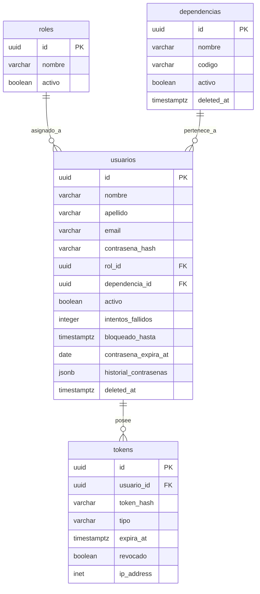
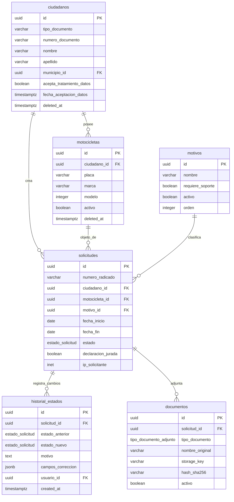
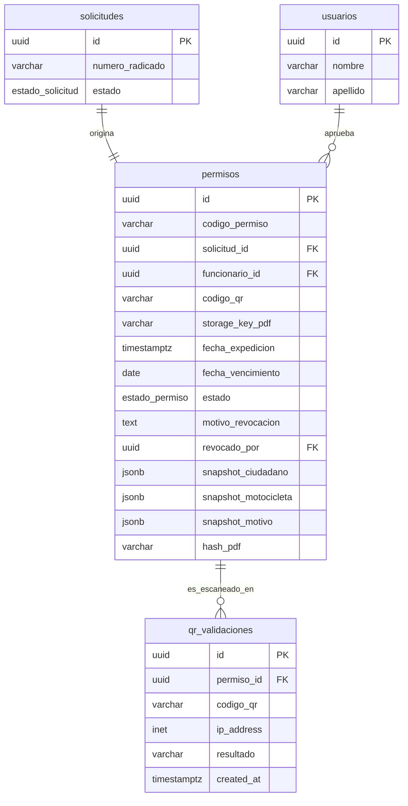
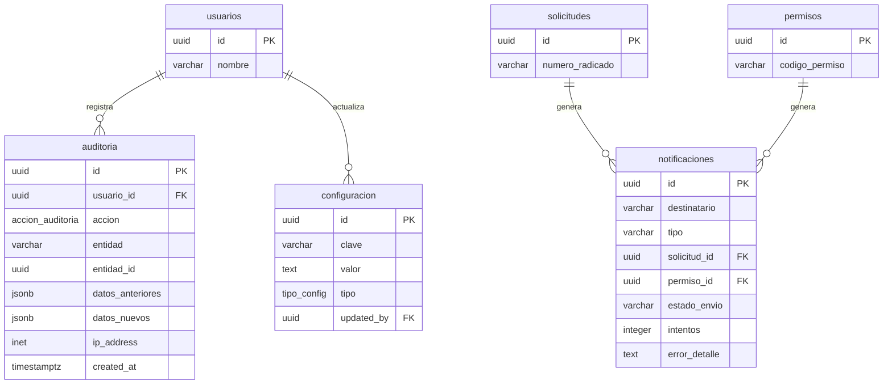
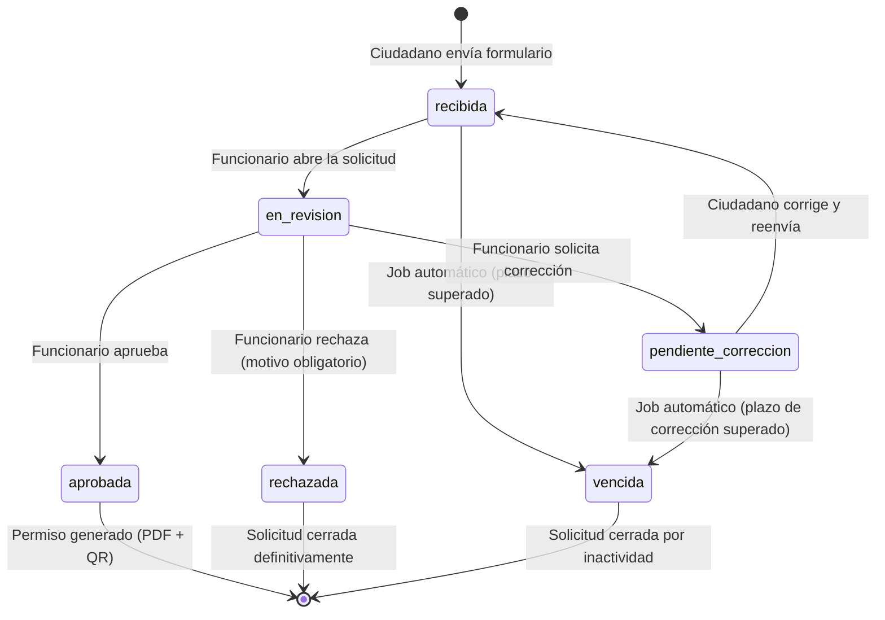
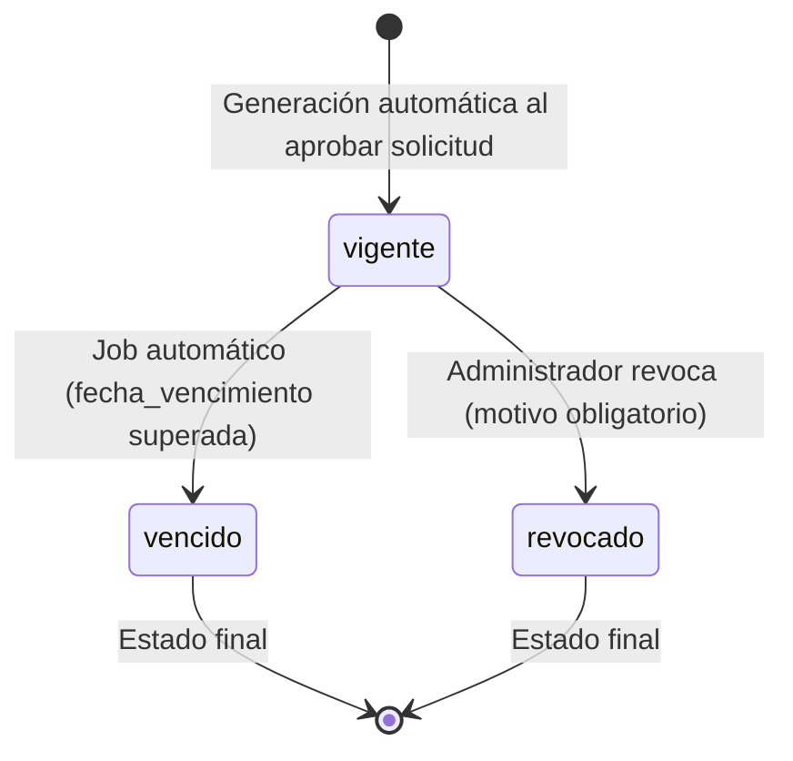
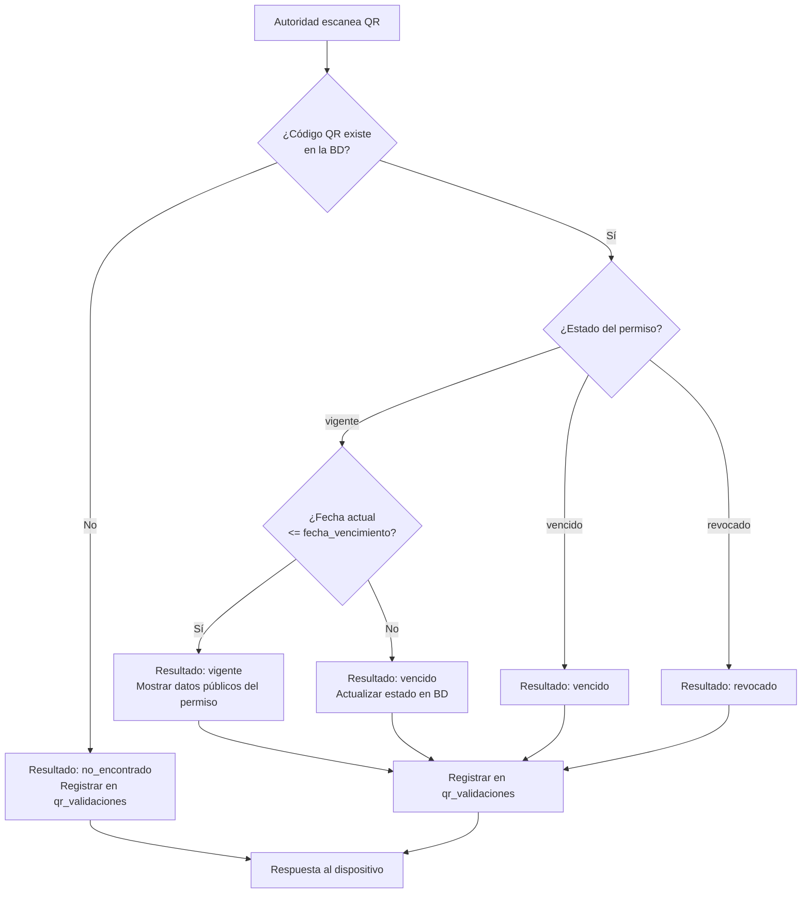

# Modelo de Datos — Sistema de Permisos de Circulación (Pico y Placa)

**Versión:** 1.0  
**Fecha:** 2026-08-02  
**Motor:** PostgreSQL 15+  
**ORM:** TypeORM con migraciones versionadas  
**Referencia:** `docs/ANALISIS_TECNICO.md` · `docs/PRD_Sistema_Permisos_de_Circulacion.md`

---

## Índice

1. [Principios de Diseño](#1-principios-de-diseño)
2. [Convenciones Globales](#2-convenciones-globales)
3. [Tipos ENUM](#3-tipos-enum)
4. [Catálogos](#4-catálogos)
5. [Módulo de Seguridad y Acceso](#5-módulo-de-seguridad-y-acceso)
6. [Módulo de Trámites](#6-módulo-de-trámites)
7. [Módulo de Permisos](#7-módulo-de-permisos)
8. [Módulo de Comunicaciones](#8-módulo-de-comunicaciones)
9. [Módulo de Auditoría y Configuración](#9-módulo-de-auditoría-y-configuración)
10. [Índices](#10-índices)
11. [Restricciones de Integridad](#11-restricciones-de-integridad)
12. [Soft Delete — Estrategia Global](#12-soft-delete--estrategia-global)
13. [Diagrama Entidad-Relación Completo](#13-diagrama-entidad-relación-completo)
14. [Diagramas por Módulo](#14-diagramas-por-módulo)
15. [Datos Semilla Requeridos](#15-datos-semilla-requeridos)
16. [Notas de Seguridad del Modelo](#16-notas-de-seguridad-del-modelo)

---

## 1. Principios de Diseño

| Principio | Aplicación en este modelo |
|-----------|--------------------------|
| **Tercera Forma Normal (3FN)** | Todas las tablas están normalizadas; sin dependencias transitivas |
| **Inmutabilidad del historial** | Las tablas `auditoria` e `historial_estados` son de solo inserción |
| **Snapshot documental** | El permiso captura el estado exacto de los datos al momento de aprobación (JSONB) |
| **Trazabilidad total** | Todo cambio de estado queda registrado con usuario, fecha e IP |
| **Separación de ciclos de vida** | La `solicitud` y el `permiso` son entidades independientes con sus propios estados |
| **Integridad referencial** | FK con ON DELETE RESTRICT por defecto; soft delete para no romper integridad |
| **Tipo de dato apropiado** | ENUM para estados, INET para IPs, TIMESTAMPTZ para fechas con zona, UUID para IDs |
| **Extensibilidad** | Catálogos (`motivos`, `configuracion`) permiten cambios sin modificar código |
| **Ley 1581/2012** | Consentimiento de tratamiento de datos almacenado con fecha en tabla `ciudadanos` |

---

## 2. Convenciones Globales

| Convención | Detalle |
|------------|---------|
| **Llave primaria** | `UUID v4` en todas las tablas. Generado en la capa de aplicación o con `gen_random_uuid()` |
| **Nombres de tablas** | `snake_case`, plural, en español |
| **Nombres de columnas** | `snake_case`, en español |
| **Soft Delete** | Columna `deleted_at TIMESTAMPTZ NULL`. Registro activo = `deleted_at IS NULL` |
| **Auditoría de fila** | `created_at`, `updated_at`, `deleted_at`, `created_by UUID`, `updated_by UUID` |
| **Zona horaria** | Todas las fechas en `UTC` (`TIMESTAMPTZ`). Conversión a `COT (UTC-5)` en capa de aplicación |
| **Booleanos** | `BOOLEAN NOT NULL DEFAULT false` — nunca nullable |
| **Textos cortos** | `VARCHAR(n)` con límite explícito |
| **Textos largos** | `TEXT` sin límite |
| **Números decimales** | `NUMERIC(p,s)` — nunca `FLOAT` para datos de negocio |
| **IPs** | Tipo nativo `INET` de PostgreSQL |
| **JSON** | `JSONB` (indexable) — nunca `JSON` |

### Columnas de auditoría de fila (plantilla)

Aplicadas a todas las tablas transaccionales:

```
created_at   TIMESTAMPTZ NOT NULL DEFAULT NOW()
updated_at   TIMESTAMPTZ
deleted_at   TIMESTAMPTZ
created_by   UUID REFERENCES usuarios(id)
updated_by   UUID REFERENCES usuarios(id)
```

Las tablas de catálogo (municipios, roles) omiten `deleted_at` y usan `activo BOOLEAN` en su lugar.  
Las tablas de solo inserción (`auditoria`, `historial_estados`, `qr_validaciones`) solo tienen `created_at`.

---

## 3. Tipos ENUM

Definidos como tipos nativos de PostgreSQL para garantizar integridad a nivel de motor:

### `estado_solicitud`
Ciclo de vida de una solicitud ciudadana.

```
recibida              — Solicitud enviada por el ciudadano, aún no revisada
en_revision           — Funcionario la abrió y está analizando
pendiente_correccion  — Funcionario solicitó al ciudadano subsanar datos
aprobada              — Solicitud aprobada; permiso generado
rechazada             — Solicitud rechazada definitivamente
vencida               — Superó el plazo sin resolución (marcado por job automático)
```

### `estado_permiso`
Ciclo de vida del documento permiso emitido.

```
vigente    — Permiso activo y dentro de la fecha de vencimiento
vencido    — Superó la fecha_vencimiento (marcado por job automático)
revocado   — Anulado explícitamente por el administrador
```

### `tipo_documento_adjunto`
Clasificación de los archivos que el ciudadano adjunta a la solicitud.

```
cedula               — Cédula de ciudadanía
licencia_conduccion  — Licencia de conducción
licencia_transito    — Licencia de tránsito de la motocicleta
soat                 — Seguro Obligatorio de Accidentes de Tránsito
rtm                  — Revisión Técnico Mecánica
carta_laboral        — Carta del empleador o contratante
otro                 — Cualquier otro soporte
```

### `tipo_config`
Tipo de valor almacenado en la tabla de configuración del sistema.

```
texto         — Cadena de texto simple
numero        — Valor numérico
booleano      — true / false
json          — Objeto JSON complejo
imagen_base64 — Imagen codificada en Base64 (logos, firmas, sellos)
```

### `accion_auditoria`
Catálogo de acciones registradas en la bitácora.

```
login                 — Ingreso exitoso al sistema
logout                — Cierre de sesión
login_fallido         — Intento de login con credenciales incorrectas
crear                 — Creación de un nuevo registro
editar                — Modificación de un registro existente
eliminar              — Eliminación (soft delete) de un registro
aprobar               — Aprobación de una solicitud
rechazar              — Rechazo de una solicitud
solicitar_correccion  — Solicitud de corrección enviada al ciudadano
generar_permiso       — Generación de PDF + QR del permiso
revocar_permiso       — Revocación de un permiso vigente
cambiar_contrasena    — Cambio de contraseña de usuario
exportar_reporte      — Exportación de un reporte
```

---

## 4. Catálogos

Los catálogos son tablas de referencia con datos controlados por el administrador. No tienen soft delete; usan `activo BOOLEAN` para activar/desactivar sin borrar.

---

### 4.1 `roles`

Roles del sistema interno. Solo funcionario y administrador tienen acceso al panel.

| Columna | Tipo | Restricción | Descripción |
|---------|------|-------------|-------------|
| `id` | UUID | PK | Identificador único |
| `nombre` | VARCHAR(50) | UNIQUE NOT NULL | Nombre del rol: `administrador`, `funcionario` |
| `descripcion` | TEXT | | Descripción del alcance del rol |
| `activo` | BOOLEAN | NOT NULL DEFAULT true | Activado/desactivado |
| `created_at` | TIMESTAMPTZ | NOT NULL DEFAULT NOW() | Fecha de creación |
| `updated_at` | TIMESTAMPTZ | | Última actualización |

**Seeds requeridos:** `administrador`, `funcionario`

---

### 4.2 `municipios`

Catálogo de municipios de Colombia con código DANE oficial.

| Columna | Tipo | Restricción | Descripción |
|---------|------|-------------|-------------|
| `id` | UUID | PK | Identificador único |
| `nombre` | VARCHAR(100) | NOT NULL | Nombre del municipio |
| `departamento` | VARCHAR(100) | NOT NULL | Nombre del departamento |
| `codigo_dane` | VARCHAR(10) | UNIQUE NOT NULL | Código DANE oficial del municipio |
| `activo` | BOOLEAN | NOT NULL DEFAULT true | Habilitado en el formulario |

**Nota:** Al menos el municipio sede de la alcaldía debe estar en seed.

---

### 4.3 `motivos`

Motivos de solicitud configurables por el administrador. Aparecen en el desplegable del formulario ciudadano.

| Columna | Tipo | Restricción | Descripción |
|---------|------|-------------|-------------|
| `id` | UUID | PK | Identificador único |
| `nombre` | VARCHAR(100) | UNIQUE NOT NULL | Nombre visible en el desplegable |
| `descripcion` | TEXT | | Descripción interna del motivo |
| `requiere_soporte` | BOOLEAN | NOT NULL DEFAULT false | Si `true`, obliga al ciudadano a adjuntar carta laboral u otro soporte |
| `activo` | BOOLEAN | NOT NULL DEFAULT true | Visible en el formulario público |
| `orden` | INTEGER | NOT NULL DEFAULT 0 | Orden de aparición en el desplegable |
| `created_at` | TIMESTAMPTZ | NOT NULL DEFAULT NOW() | |
| `updated_at` | TIMESTAMPTZ | | |
| `created_by` | UUID | FK usuarios | Usuario que lo creó |
| `updated_by` | UUID | FK usuarios | Usuario que lo modificó |

**Seeds requeridos:** Trabajo · Emergencia médica · Prestación de servicios · Domicilios · Contratista · Empresa pública · Empresa privada · Fuerza mayor · Otro

---

### 4.4 `dependencias`

Secretarías o dependencias de la alcaldía a las que pertenecen los funcionarios.

| Columna | Tipo | Restricción | Descripción |
|---------|------|-------------|-------------|
| `id` | UUID | PK | Identificador único |
| `nombre` | VARCHAR(100) | NOT NULL | Nombre de la dependencia (ej: Secretaría de Movilidad) |
| `codigo` | VARCHAR(20) | UNIQUE NOT NULL | Código interno |
| `descripcion` | TEXT | | Descripción de la dependencia |
| `activo` | BOOLEAN | NOT NULL DEFAULT true | Activa/inactiva |
| `created_at` | TIMESTAMPTZ | NOT NULL DEFAULT NOW() | |
| `updated_at` | TIMESTAMPTZ | | |
| `deleted_at` | TIMESTAMPTZ | | Soft delete |
| `created_by` | UUID | FK usuarios | |
| `updated_by` | UUID | FK usuarios | |

---

## 5. Módulo de Seguridad y Acceso

---

### 5.1 `usuarios`

Funcionarios y administradores del sistema. El ciudadano no tiene cuenta en esta tabla.

| Columna | Tipo | Restricción | Descripción |
|---------|------|-------------|-------------|
| `id` | UUID | PK | Identificador único |
| `nombre` | VARCHAR(100) | NOT NULL | Nombre del funcionario |
| `apellido` | VARCHAR(100) | NOT NULL | Apellido del funcionario |
| `email` | VARCHAR(150) | UNIQUE NOT NULL | Correo institucional (usado para login) |
| `contrasena_hash` | VARCHAR(255) | NOT NULL | Hash BCrypt con 12 rounds mínimo |
| `rol_id` | UUID | FK roles NOT NULL | Rol asignado |
| `dependencia_id` | UUID | FK dependencias | Dependencia a la que pertenece |
| `activo` | BOOLEAN | NOT NULL DEFAULT true | Cuenta habilitada |
| `ultimo_login` | TIMESTAMPTZ | | Fecha y hora del último ingreso exitoso |
| `intentos_fallidos` | INTEGER | NOT NULL DEFAULT 0 | Contador de intentos fallidos consecutivos |
| `bloqueado_hasta` | TIMESTAMPTZ | | Bloqueo temporal tras 5 intentos fallidos (30 minutos) |
| `contrasena_expira_at` | DATE | | Fecha de expiración de la contraseña (cada 90 días) |
| `historial_contrasenas` | JSONB | NOT NULL DEFAULT '[]' | Array con los últimos 5 hashes de contraseñas usadas |
| `created_at` | TIMESTAMPTZ | NOT NULL DEFAULT NOW() | |
| `updated_at` | TIMESTAMPTZ | | |
| `deleted_at` | TIMESTAMPTZ | | Soft delete |
| `created_by` | UUID | FK usuarios | Administrador que creó la cuenta |
| `updated_by` | UUID | FK usuarios | Administrador que la modificó |

**Reglas de negocio aplicadas en esta tabla:**
- `intentos_fallidos` se resetea a 0 al hacer login exitoso.
- `bloqueado_hasta` se establece en `NOW() + 30 min` al alcanzar 5 intentos fallidos.
- `contrasena_expira_at` se calcula en la capa de aplicación al cambiar contraseña.
- `historial_contrasenas` impide reutilizar cualquiera de las últimas 5 contraseñas.

---

### 5.2 `tokens`

Tokens de refresh y de recuperación de contraseña. Permite control completo sobre sesiones activas.

| Columna | Tipo | Restricción | Descripción |
|---------|------|-------------|-------------|
| `id` | UUID | PK | Identificador único |
| `usuario_id` | UUID | FK usuarios NOT NULL | Propietario del token |
| `token_hash` | VARCHAR(255) | NOT NULL | Hash SHA-256 del token (nunca el token en texto plano) |
| `tipo` | VARCHAR(20) | NOT NULL | `refresh` o `reset_contrasena` |
| `expira_at` | TIMESTAMPTZ | NOT NULL | Fecha de expiración del token |
| `revocado` | BOOLEAN | NOT NULL DEFAULT false | Marcado como inválido al hacer logout o uso de refresh |
| `revocado_at` | TIMESTAMPTZ | | Cuándo fue revocado |
| `ip_address` | INET | | IP desde donde se originó la sesión |
| `user_agent` | TEXT | | Agente de usuario (navegador/dispositivo) |
| `created_at` | TIMESTAMPTZ | NOT NULL DEFAULT NOW() | |

**Estrategia de rotación:** Al usar un refresh token, se revoca el actual y se emite uno nuevo. Así, un token robado detectado por uso concurrente invalida la sesión.

---

## 6. Módulo de Trámites

---

### 6.1 `ciudadanos`

Personas naturales que realizan solicitudes. No tienen login; se identifican por `numero_documento`.

| Columna | Tipo | Restricción | Descripción |
|---------|------|-------------|-------------|
| `id` | UUID | PK | Identificador único |
| `tipo_documento` | VARCHAR(20) | NOT NULL | `CC` · `CE` · `PAS` · `TI` · `NIT` |
| `numero_documento` | VARCHAR(20) | UNIQUE NOT NULL | Número de documento de identidad |
| `nombre` | VARCHAR(100) | NOT NULL | Primer nombre y segundo nombre |
| `apellido` | VARCHAR(100) | NOT NULL | Primer apellido y segundo apellido |
| `fecha_nacimiento` | DATE | | Fecha de nacimiento |
| `direccion` | VARCHAR(200) | | Dirección de residencia |
| `barrio` | VARCHAR(100) | | Barrio de residencia |
| `municipio_id` | UUID | FK municipios | Municipio de residencia |
| `celular` | VARCHAR(20) | | Número de celular |
| `email` | VARCHAR(150) | | Correo electrónico para notificaciones |
| `acepta_tratamiento_datos` | BOOLEAN | NOT NULL DEFAULT false | Autorización Ley 1581/2012 — obligatoria para crear solicitud |
| `fecha_aceptacion_datos` | TIMESTAMPTZ | | Fecha exacta en que aceptó el tratamiento de datos |
| `created_at` | TIMESTAMPTZ | NOT NULL DEFAULT NOW() | |
| `updated_at` | TIMESTAMPTZ | | |
| `deleted_at` | TIMESTAMPTZ | | Soft delete |

**Regla RN-03:** Un ciudadano no puede tener dos solicitudes activas simultáneas para la misma motocicleta. Validado en capa de aplicación.  
**Ley 1581:** No se puede crear solicitud si `acepta_tratamiento_datos = false`.

---

### 6.2 `motocicletas`

Vehículos asociados a un ciudadano. Una moto puede pertenecer a un solo ciudadano en el sistema.

| Columna | Tipo | Restricción | Descripción |
|---------|------|-------------|-------------|
| `id` | UUID | PK | Identificador único |
| `ciudadano_id` | UUID | FK ciudadanos NOT NULL | Propietario registrado |
| `placa` | VARCHAR(10) | NOT NULL | Placa en formato colombiano (`ABC123` o `ABC12D`) |
| `marca` | VARCHAR(50) | | Marca del vehículo (ej: Yamaha, Honda, Bajaj) |
| `linea` | VARCHAR(50) | | Línea o modelo del vehículo (ej: FZ 150) |
| `modelo` | INTEGER | | Año modelo (ej: 2022) |
| `cilindraje` | INTEGER | | Cilindraje en cc (ej: 150) |
| `color` | VARCHAR(50) | | Color principal del vehículo |
| `numero_motor` | VARCHAR(50) | | Número de motor según tarjeta de propiedad |
| `numero_chasis` | VARCHAR(50) | | Número de chasis según tarjeta de propiedad |
| `activo` | BOOLEAN | NOT NULL DEFAULT true | La moto está vigente en el sistema |
| `created_at` | TIMESTAMPTZ | NOT NULL DEFAULT NOW() | |
| `updated_at` | TIMESTAMPTZ | | |
| `deleted_at` | TIMESTAMPTZ | | Soft delete |

**Constraint de unicidad funcional:** `(placa, deleted_at IS NULL)` — No puede haber dos motos activas con la misma placa.

---

### 6.3 `solicitudes`

Entidad central del trámite. Registra cada solicitud de permiso de circulación.

| Columna | Tipo | Restricción | Descripción |
|---------|------|-------------|-------------|
| `id` | UUID | PK | Identificador único |
| `numero_radicado` | VARCHAR(25) | UNIQUE NOT NULL | Número de radicado. Formato: `20260802-PYP-001234` |
| `ciudadano_id` | UUID | FK ciudadanos NOT NULL | Ciudadano solicitante |
| `motocicleta_id` | UUID | FK motocicletas NOT NULL | Motocicleta para la que se solicita el permiso |
| `motivo_id` | UUID | FK motivos NOT NULL | Motivo de la solicitud |
| `fecha_inicio` | DATE | NOT NULL | Fecha de inicio solicitada para el permiso |
| `fecha_fin` | DATE | NOT NULL | Fecha de fin solicitada para el permiso |
| `descripcion_adicional` | TEXT | | Contexto adicional que el ciudadano quiera agregar |
| `estado` | estado_solicitud | NOT NULL DEFAULT 'recibida' | Estado actual en el ciclo de vida |
| `declaracion_jurada` | BOOLEAN | NOT NULL DEFAULT false | El ciudadano aceptó que los datos son verídicos |
| `ip_solicitante` | INET | | IP desde donde se creó la solicitud |
| `recaptcha_score` | NUMERIC(3,2) | | Puntuación reCAPTCHA v3 (0.0 a 1.0) |
| `created_at` | TIMESTAMPTZ | NOT NULL DEFAULT NOW() | Fecha de creación de la solicitud |
| `updated_at` | TIMESTAMPTZ | | Última actualización |
| `deleted_at` | TIMESTAMPTZ | | Soft delete (rara vez usado; historial preservado) |

**Constraints:**
- `fecha_fin >= fecha_inicio`
- `declaracion_jurada = true` es obligatorio para crear solicitud (validado en aplicación)
- `numero_radicado` generado en la capa de aplicación con formato controlado

---

### 6.4 `historial_estados`

Registro inmutable de cada cambio de estado de una solicitud. Proporciona la trazabilidad legal requerida.

| Columna | Tipo | Restricción | Descripción |
|---------|------|-------------|-------------|
| `id` | UUID | PK | Identificador único |
| `solicitud_id` | UUID | FK solicitudes NOT NULL | Solicitud a la que pertenece |
| `estado_anterior` | estado_solicitud | | Estado previo al cambio. NULL si es el primer estado |
| `estado_nuevo` | estado_solicitud | NOT NULL | Nuevo estado después del cambio |
| `motivo` | TEXT | | Motivo del rechazo o corrección (obligatorio en esos casos) |
| `campos_correccion` | JSONB | | Array de campos específicos que el ciudadano debe corregir |
| `usuario_id` | UUID | FK usuarios | Funcionario que realizó el cambio. NULL si es automático (job) |
| `ip_address` | INET | | IP del funcionario al realizar el cambio |
| `created_at` | TIMESTAMPTZ | NOT NULL DEFAULT NOW() | Fecha y hora exacta del cambio |

**Regla:** Solo inserción. Nunca se actualiza ni elimina un registro de esta tabla.

---

### 6.5 `documentos`

Archivos adjuntos aportados por el ciudadano como soportes de la solicitud.

| Columna | Tipo | Restricción | Descripción |
|---------|------|-------------|-------------|
| `id` | UUID | PK | Identificador único |
| `solicitud_id` | UUID | FK solicitudes NOT NULL | Solicitud a la que pertenece |
| `tipo_documento` | tipo_documento_adjunto | NOT NULL | Clasificación del documento |
| `nombre_original` | VARCHAR(255) | NOT NULL | Nombre del archivo tal como lo subió el ciudadano |
| `nombre_almacenado` | VARCHAR(255) | NOT NULL | Nombre con el que se guardó en storage (UUID + extensión) |
| `storage_key` | VARCHAR(500) | NOT NULL | Ruta relativa interna en MinIO/S3. **Nunca se expone en API** |
| `mime_type` | VARCHAR(100) | NOT NULL | Tipo MIME: `application/pdf`, `image/jpeg`, `image/png` |
| `tamano_bytes` | INTEGER | NOT NULL | Tamaño del archivo en bytes |
| `hash_sha256` | VARCHAR(64) | NOT NULL | Hash SHA-256 del archivo para verificar integridad |
| `activo` | BOOLEAN | NOT NULL DEFAULT true | Falso si el ciudadano reemplazó el documento |
| `created_at` | TIMESTAMPTZ | NOT NULL DEFAULT NOW() | Fecha de carga |

**Regla RN-09:** Los documentos se conservan aunque la solicitud sea rechazada. Nunca se eliminan físicamente.  
**Acceso:** Exclusivamente mediante URLs firmadas con TTL de 5 minutos generadas bajo petición autenticada del funcionario.

---

## 7. Módulo de Permisos

---

### 7.1 `permisos`

Documento oficial generado al aprobar una solicitud. Entidad independiente con su propio ciclo de vida.

| Columna | Tipo | Restricción | Descripción |
|---------|------|-------------|-------------|
| `id` | UUID | PK | Identificador único |
| `codigo_permiso` | VARCHAR(20) | UNIQUE NOT NULL | Número consecutivo institucional. Formato: `2026-PYP-00145` |
| `solicitud_id` | UUID | FK solicitudes UNIQUE NOT NULL | Solicitud que originó este permiso (relación 1:1) |
| `funcionario_id` | UUID | FK usuarios NOT NULL | Funcionario que aprobó y generó el permiso |
| `codigo_qr` | VARCHAR(100) | UNIQUE NOT NULL | Identificador opaco del QR (UUID + hash SHA-256 con salt). Nunca contiene datos personales |
| `storage_key_pdf` | VARCHAR(500) | NOT NULL | Ruta interna del PDF en MinIO/S3. **Nunca se expone en API** |
| `fecha_expedicion` | TIMESTAMPTZ | NOT NULL | Fecha y hora exacta de generación del permiso |
| `fecha_vencimiento` | DATE | NOT NULL | Fecha hasta la que el permiso es válido |
| `estado` | estado_permiso | NOT NULL DEFAULT 'vigente' | Estado actual del permiso |
| `motivo_revocacion` | TEXT | | Obligatorio si `estado = 'revocado'` |
| `revocado_at` | TIMESTAMPTZ | | Fecha y hora de la revocación |
| `revocado_por` | UUID | FK usuarios | Administrador que revocó el permiso |
| `snapshot_ciudadano` | JSONB | NOT NULL | Copia exacta de los datos del ciudadano al momento de aprobación |
| `snapshot_motocicleta` | JSONB | NOT NULL | Copia exacta de los datos de la moto al momento de aprobación |
| `snapshot_motivo` | JSONB | NOT NULL | Copia del motivo autorizado al momento de aprobación |
| `hash_pdf` | VARCHAR(64) | | Hash SHA-256 del PDF generado (integridad documental) |
| `created_at` | TIMESTAMPTZ | NOT NULL DEFAULT NOW() | |
| `updated_at` | TIMESTAMPTZ | | |

**Constraints:**
- `fecha_vencimiento > fecha_expedicion::DATE`
- `codigo_permiso` sigue secuencia global nunca reutilizable

**Regla RN-05:** Si se regenera un permiso tras revocación, el nuevo `codigo_qr` es diferente al anterior.  
**Regla RN-06:** El PDF se genera con los datos del snapshot, no consultando las tablas en tiempo real.  
**Regla RN-07:** La secuencia del `codigo_permiso` es gestionada por una secuencia PostgreSQL dedicada.

---

### 7.2 `qr_validaciones`

Registro de cada consulta realizada al escanear un código QR. Permite auditar el uso de los permisos en campo.

| Columna | Tipo | Restricción | Descripción |
|---------|------|-------------|-------------|
| `id` | UUID | PK | Identificador único |
| `permiso_id` | UUID | FK permisos | Permiso consultado. NULL si el código QR no existe en el sistema |
| `codigo_qr` | VARCHAR(100) | NOT NULL | El código QR exacto que se escaneó |
| `ip_address` | INET | | IP del dispositivo que realizó la consulta |
| `user_agent` | TEXT | | Agente de usuario (navegador del celular del agente de tránsito) |
| `resultado` | VARCHAR(20) | NOT NULL | `vigente` · `vencido` · `revocado` · `no_encontrado` |
| `created_at` | TIMESTAMPTZ | NOT NULL DEFAULT NOW() | Fecha y hora exacta del escaneo |

**Regla:** Solo inserción. No se actualiza ni elimina.  
**Uso:** Reportes de actividad de verificación, detección de uso anómalo de un código QR.

---

## 8. Módulo de Comunicaciones

---

### 8.1 `notificaciones`

Cola de correos electrónicos enviados o pendientes de envío. Permite reintentos y trazabilidad de entrega.

| Columna | Tipo | Restricción | Descripción |
|---------|------|-------------|-------------|
| `id` | UUID | PK | Identificador único |
| `destinatario` | VARCHAR(150) | NOT NULL | Correo del ciudadano |
| `asunto` | VARCHAR(200) | NOT NULL | Asunto del correo |
| `tipo` | VARCHAR(50) | NOT NULL | `solicitud_recibida` · `aprobada` · `rechazada` · `correccion` |
| `solicitud_id` | UUID | FK solicitudes | Solicitud relacionada |
| `permiso_id` | UUID | FK permisos | Permiso relacionado (si aplica) |
| `estado_envio` | VARCHAR(20) | NOT NULL DEFAULT 'pendiente' | `pendiente` · `enviado` · `error` |
| `intentos` | INTEGER | NOT NULL DEFAULT 0 | Número de intentos de envío realizados |
| `ultimo_intento` | TIMESTAMPTZ | | Fecha del último intento de envío |
| `error_detalle` | TEXT | | Mensaje de error del último intento fallido |
| `created_at` | TIMESTAMPTZ | NOT NULL DEFAULT NOW() | |
| `updated_at` | TIMESTAMPTZ | | |

**Estrategia de reintentos:** BullMQ con backoff exponencial. Máximo 3 intentos. Si falla, `estado_envio = 'error'` y pasa a Dead Letter Queue para revisión manual.

---

## 9. Módulo de Auditoría y Configuración

---

### 9.1 `auditoria`

Bitácora inmutable de todas las acciones relevantes del sistema. Cumplimiento Ley 1712/2014 — retención mínima 5 años.

| Columna | Tipo | Restricción | Descripción |
|---------|------|-------------|-------------|
| `id` | UUID | PK | Identificador único |
| `usuario_id` | UUID | FK usuarios | Usuario que realizó la acción. NULL para acciones públicas (crear solicitud, validar QR) |
| `accion` | accion_auditoria | NOT NULL | Tipo de acción realizada |
| `entidad` | VARCHAR(50) | | Nombre de la tabla/entidad afectada (ej: `solicitud`, `permiso`, `usuario`) |
| `entidad_id` | UUID | | ID del registro afectado |
| `datos_anteriores` | JSONB | | Estado del registro antes del cambio. NULL para creaciones |
| `datos_nuevos` | JSONB | | Estado del registro después del cambio. NULL para eliminaciones |
| `ip_address` | INET | | IP del actor |
| `user_agent` | TEXT | | Agente de usuario |
| `created_at` | TIMESTAMPTZ | NOT NULL DEFAULT NOW() | Fecha y hora exacta de la acción |

**Reglas críticas:**
- **Solo inserción.** Ningún proceso del sistema puede hacer `UPDATE` o `DELETE` sobre esta tabla.
- Permisos de BD: el usuario de aplicación solo tiene `INSERT` y `SELECT` sobre `auditoria`.
- Retención mínima de 5 años conforme a la Ley 1712/2014.
- Solo el Administrador puede consultar esta tabla vía la API.

---

### 9.2 `configuracion`

Parámetros operativos del sistema gestionados por el administrador sin necesidad de modificar código.

| Columna | Tipo | Restricción | Descripción |
|---------|------|-------------|-------------|
| `id` | UUID | PK | Identificador único |
| `clave` | VARCHAR(100) | UNIQUE NOT NULL | Nombre del parámetro (ej: `nombre_alcaldia`) |
| `valor` | TEXT | | Valor del parámetro en texto o Base64 |
| `tipo` | tipo_config | NOT NULL DEFAULT 'texto' | Tipo de dato del valor |
| `descripcion` | TEXT | | Descripción del parámetro para el administrador |
| `updated_at` | TIMESTAMPTZ | | Última actualización |
| `updated_by` | UUID | FK usuarios | Administrador que lo modificó |

**Parámetros semilla requeridos:**

| Clave | Tipo | Default |
|-------|------|---------|
| `nombre_alcaldia` | texto | — |
| `municipio` | texto | — |
| `logo_url` | texto | — |
| `firma_url` | imagen_base64 | — |
| `sello_url` | imagen_base64 | — |
| `dias_max_permiso` | numero | 30 |
| `plazo_revision_horas` | numero | 48 |
| `plazo_correccion_dias` | numero | 5 |
| `color_institucional` | texto | #1a56db |

---

## 10. Índices

Todos los índices se crean junto con las tablas, no como corrección posterior.

### Índices por tabla

```
── solicitudes ─────────────────────────────────────────────────────
idx_solicitudes_numero_radicado     (numero_radicado)           UNIQUE
idx_solicitudes_estado              (estado)
idx_solicitudes_created_at          (created_at DESC)
idx_solicitudes_ciudadano_id        (ciudadano_id)
idx_solicitudes_motocicleta_id      (motocicleta_id)
idx_solicitudes_estado_moto         (motocicleta_id, estado)    Composite — valida RN-03

── ciudadanos ──────────────────────────────────────────────────────
idx_ciudadanos_numero_documento     (numero_documento)          UNIQUE
idx_ciudadanos_email                (email)

── motocicletas ────────────────────────────────────────────────────
idx_motocicletas_placa              (placa)
idx_motocicletas_ciudadano_id       (ciudadano_id)
idx_motocicletas_placa_activo       (placa) WHERE deleted_at IS NULL   Partial

── permisos ────────────────────────────────────────────────────────
idx_permisos_codigo_qr              (codigo_qr)                 UNIQUE
idx_permisos_codigo_permiso         (codigo_permiso)            UNIQUE
idx_permisos_estado                 (estado)
idx_permisos_fecha_vencimiento      (fecha_vencimiento)
idx_permisos_solicitud_id           (solicitud_id)              UNIQUE
idx_permisos_funcionario_id         (funcionario_id)

── historial_estados ───────────────────────────────────────────────
idx_historial_solicitud_created     (solicitud_id, created_at DESC)

── documentos ──────────────────────────────────────────────────────
idx_documentos_solicitud_id         (solicitud_id)

── tokens ──────────────────────────────────────────────────────────
idx_tokens_token_hash               (token_hash)
idx_tokens_usuario_tipo_revocado    (usuario_id, tipo, revocado)

── usuarios ────────────────────────────────────────────────────────
idx_usuarios_email                  (email)                     UNIQUE
idx_usuarios_rol_id                 (rol_id)

── auditoria ───────────────────────────────────────────────────────
idx_auditoria_created_at            (created_at DESC)
idx_auditoria_usuario_id            (usuario_id)
idx_auditoria_accion                (accion)
idx_auditoria_entidad_id            (entidad, entidad_id)

── qr_validaciones ─────────────────────────────────────────────────
idx_qr_validaciones_permiso_id      (permiso_id, created_at DESC)
idx_qr_validaciones_created_at      (created_at DESC)

── notificaciones ──────────────────────────────────────────────────
idx_notificaciones_estado_envio     (estado_envio)
idx_notificaciones_solicitud_id     (solicitud_id)
```

### Índices parciales (Partial Indexes)

Optimizan consultas sobre subconjuntos frecuentes sin indexar toda la tabla:

```
-- Solo solicitudes activas (las más consultadas por los funcionarios)
idx_solicitudes_activas   ON solicitudes(estado, created_at DESC)
WHERE estado IN ('recibida', 'en_revision', 'pendiente_correccion')

-- Solo permisos vigentes (para el job de vencimiento)
idx_permisos_vigentes     ON permisos(fecha_vencimiento)
WHERE estado = 'vigente'

-- Solo tokens activos
idx_tokens_activos        ON tokens(token_hash, expira_at)
WHERE revocado = false

-- Motos activas sin soft delete (para validar unicidad de placa)
idx_motocicletas_activas  ON motocicletas(placa)
WHERE deleted_at IS NULL
```

---

## 11. Restricciones de Integridad

### Constraints de clave foránea

Todas las FK usan `ON DELETE RESTRICT` — no se pueden borrar registros referenciados. El soft delete protege la integridad referencial.

```
usuarios.rol_id              → roles(id)          RESTRICT
usuarios.dependencia_id      → dependencias(id)   RESTRICT
usuarios.created_by          → usuarios(id)       RESTRICT
tokens.usuario_id            → usuarios(id)       RESTRICT
ciudadanos.municipio_id      → municipios(id)     RESTRICT
motocicletas.ciudadano_id    → ciudadanos(id)     RESTRICT
solicitudes.ciudadano_id     → ciudadanos(id)     RESTRICT
solicitudes.motocicleta_id   → motocicletas(id)   RESTRICT
solicitudes.motivo_id        → motivos(id)        RESTRICT
historial_estados.solicitud_id → solicitudes(id)  RESTRICT
historial_estados.usuario_id → usuarios(id)       RESTRICT
documentos.solicitud_id      → solicitudes(id)    RESTRICT
permisos.solicitud_id        → solicitudes(id)    RESTRICT
permisos.funcionario_id      → usuarios(id)       RESTRICT
permisos.revocado_por        → usuarios(id)       RESTRICT
qr_validaciones.permiso_id   → permisos(id)       RESTRICT
notificaciones.solicitud_id  → solicitudes(id)    RESTRICT
notificaciones.permiso_id    → permisos(id)       RESTRICT
auditoria.usuario_id         → usuarios(id)       RESTRICT
configuracion.updated_by     → usuarios(id)       RESTRICT
motivos.created_by           → usuarios(id)       RESTRICT
dependencias.created_by      → usuarios(id)       RESTRICT
```

### Constraints de dominio (CHECK)

```
solicitudes:
  CHECK (fecha_fin >= fecha_inicio)
  CHECK (declaracion_jurada = true)              -- no permite false al insertar

permisos:
  CHECK (fecha_vencimiento > fecha_expedicion::DATE)
  CHECK (
    (estado = 'revocado' AND motivo_revocacion IS NOT NULL AND revocado_at IS NOT NULL)
    OR estado <> 'revocado'
  )

usuarios:
  CHECK (intentos_fallidos >= 0)
  CHECK (LENGTH(email) > 5 AND email LIKE '%@%.%')

motocicletas:
  CHECK (modelo IS NULL OR (modelo >= 1900 AND modelo <= 2100))
  CHECK (cilindraje IS NULL OR cilindraje > 0)

documentos:
  CHECK (tamano_bytes > 0)
  CHECK (mime_type IN ('application/pdf', 'image/jpeg', 'image/png'))

ciudadanos:
  CHECK (
    (acepta_tratamiento_datos = true AND fecha_aceptacion_datos IS NOT NULL)
    OR acepta_tratamiento_datos = false
  )
```

### Constraints de unicidad funcional

```
-- No puede haber dos motos activas con la misma placa
CREATE UNIQUE INDEX uq_motocicletas_placa_activa
  ON motocicletas(placa)
  WHERE deleted_at IS NULL;

-- Un ciudadano solo puede tener una solicitud activa por moto
-- (Validado en aplicación por regla de negocio RN-03; no como constraint de BD
--  porque los estados activos son múltiples)

-- Un permiso por solicitud (relación 1:1)
UNIQUE (solicitud_id) en tabla permisos
```

### Secuencia para el número consecutivo del permiso

```sql
CREATE SEQUENCE seq_codigo_permiso
  START WITH 1
  INCREMENT BY 1
  NO MAXVALUE
  NO CYCLE;
```

El `codigo_permiso` se construye en aplicación: `EXTRACT(YEAR FROM NOW()) || '-PYP-' || LPAD(nextval('seq_codigo_permiso')::text, 5, '0')`

---

## 12. Soft Delete — Estrategia Global

### Tablas con soft delete

| Tabla | Columna | Comportamiento |
|-------|---------|----------------|
| `usuarios` | `deleted_at` | El usuario no puede ingresar al sistema; sus registros históricos se conservan |
| `ciudadanos` | `deleted_at` | Solo el administrador puede eliminar; historial de solicitudes preservado |
| `motocicletas` | `deleted_at` | La moto queda inactiva; las solicitudes históricas permanecen |
| `solicitudes` | `deleted_at` | Raro uso; el historial de estados siempre permanece |
| `dependencias` | `deleted_at` | La dependencia queda inactiva; los usuarios que la tenían conservan la referencia |

### Tablas sin soft delete (usan `activo BOOLEAN`)

| Tabla | Razón |
|-------|-------|
| `roles` | Catálogo estático; desactivar es suficiente |
| `municipios` | Catálogo nacional; nunca se borra |
| `motivos` | Configurables; activar/desactivar es el flujo correcto |
| `documentos` | Columna `activo`; el archivo físico nunca se borra de storage |

### Tablas inmutables (solo inserción)

| Tabla | Razón |
|-------|-------|
| `auditoria` | Bitácora legal; no se modifica bajo ninguna circunstancia |
| `historial_estados` | Trazabilidad inmutable del ciclo de vida de una solicitud |
| `qr_validaciones` | Registro de accesos; no modificable |

### Convención de consultas con soft delete

Todo `SELECT` sobre tablas con soft delete debe incluir:
```sql
WHERE deleted_at IS NULL
```
El ORM (TypeORM) debe configurarse con `@DeleteDateColumn()` para aplicarlo automáticamente.

---

## 13. Diagrama Entidad-Relación Completo

```mermaid
erDiagram

    roles {
        uuid id PK
        varchar nombre
        text descripcion
        boolean activo
        timestamptz created_at
        timestamptz updated_at
    }

    dependencias {
        uuid id PK
        varchar nombre
        varchar codigo
        text descripcion
        boolean activo
        timestamptz created_at
        timestamptz updated_at
        timestamptz deleted_at
        uuid created_by FK
        uuid updated_by FK
    }

    usuarios {
        uuid id PK
        varchar nombre
        varchar apellido
        varchar email
        varchar contrasena_hash
        uuid rol_id FK
        uuid dependencia_id FK
        boolean activo
        timestamptz ultimo_login
        integer intentos_fallidos
        timestamptz bloqueado_hasta
        date contrasena_expira_at
        jsonb historial_contrasenas
        timestamptz created_at
        timestamptz updated_at
        timestamptz deleted_at
        uuid created_by FK
        uuid updated_by FK
    }

    tokens {
        uuid id PK
        uuid usuario_id FK
        varchar token_hash
        varchar tipo
        timestamptz expira_at
        boolean revocado
        timestamptz revocado_at
        inet ip_address
        text user_agent
        timestamptz created_at
    }

    municipios {
        uuid id PK
        varchar nombre
        varchar departamento
        varchar codigo_dane
        boolean activo
    }

    ciudadanos {
        uuid id PK
        varchar tipo_documento
        varchar numero_documento
        varchar nombre
        varchar apellido
        date fecha_nacimiento
        varchar direccion
        varchar barrio
        uuid municipio_id FK
        varchar celular
        varchar email
        boolean acepta_tratamiento_datos
        timestamptz fecha_aceptacion_datos
        timestamptz created_at
        timestamptz updated_at
        timestamptz deleted_at
    }

    motocicletas {
        uuid id PK
        uuid ciudadano_id FK
        varchar placa
        varchar marca
        varchar linea
        integer modelo
        integer cilindraje
        varchar color
        varchar numero_motor
        varchar numero_chasis
        boolean activo
        timestamptz created_at
        timestamptz updated_at
        timestamptz deleted_at
    }

    motivos {
        uuid id PK
        varchar nombre
        text descripcion
        boolean requiere_soporte
        boolean activo
        integer orden
        timestamptz created_at
        timestamptz updated_at
        uuid created_by FK
        uuid updated_by FK
    }

    solicitudes {
        uuid id PK
        varchar numero_radicado
        uuid ciudadano_id FK
        uuid motocicleta_id FK
        uuid motivo_id FK
        date fecha_inicio
        date fecha_fin
        text descripcion_adicional
        estado_solicitud estado
        boolean declaracion_jurada
        inet ip_solicitante
        numeric recaptcha_score
        timestamptz created_at
        timestamptz updated_at
        timestamptz deleted_at
    }

    historial_estados {
        uuid id PK
        uuid solicitud_id FK
        estado_solicitud estado_anterior
        estado_solicitud estado_nuevo
        text motivo
        jsonb campos_correccion
        uuid usuario_id FK
        inet ip_address
        timestamptz created_at
    }

    documentos {
        uuid id PK
        uuid solicitud_id FK
        tipo_documento_adjunto tipo_documento
        varchar nombre_original
        varchar nombre_almacenado
        varchar storage_key
        varchar mime_type
        integer tamano_bytes
        varchar hash_sha256
        boolean activo
        timestamptz created_at
    }

    permisos {
        uuid id PK
        varchar codigo_permiso
        uuid solicitud_id FK
        uuid funcionario_id FK
        varchar codigo_qr
        varchar storage_key_pdf
        timestamptz fecha_expedicion
        date fecha_vencimiento
        estado_permiso estado
        text motivo_revocacion
        timestamptz revocado_at
        uuid revocado_por FK
        jsonb snapshot_ciudadano
        jsonb snapshot_motocicleta
        jsonb snapshot_motivo
        varchar hash_pdf
        timestamptz created_at
        timestamptz updated_at
    }

    qr_validaciones {
        uuid id PK
        uuid permiso_id FK
        varchar codigo_qr
        inet ip_address
        text user_agent
        varchar resultado
        timestamptz created_at
    }

    notificaciones {
        uuid id PK
        varchar destinatario
        varchar asunto
        varchar tipo
        uuid solicitud_id FK
        uuid permiso_id FK
        varchar estado_envio
        integer intentos
        timestamptz ultimo_intento
        text error_detalle
        timestamptz created_at
        timestamptz updated_at
    }

    auditoria {
        uuid id PK
        uuid usuario_id FK
        accion_auditoria accion
        varchar entidad
        uuid entidad_id
        jsonb datos_anteriores
        jsonb datos_nuevos
        inet ip_address
        text user_agent
        timestamptz created_at
    }

    configuracion {
        uuid id PK
        varchar clave
        text valor
        tipo_config tipo
        text descripcion
        timestamptz updated_at
        uuid updated_by FK
    }

    roles ||--o{ usuarios : "tiene"
    dependencias ||--o{ usuarios : "pertenece_a"
    usuarios ||--o{ tokens : "posee"
    usuarios ||--o{ auditoria : "genera"
    usuarios ||--o{ historial_estados : "registra"
    usuarios ||--o{ permisos : "aprueba"
    municipios ||--o{ ciudadanos : "reside_en"
    ciudadanos ||--o{ motocicletas : "posee"
    ciudadanos ||--o{ solicitudes : "crea"
    motocicletas ||--o{ solicitudes : "objeto_de"
    motivos ||--o{ solicitudes : "clasifica"
    solicitudes ||--o{ historial_estados : "tiene"
    solicitudes ||--o{ documentos : "adjunta"
    solicitudes ||--|| permisos : "genera"
    solicitudes ||--o{ notificaciones : "origina"
    permisos ||--o{ qr_validaciones : "es_escaneado"
    permisos ||--o{ notificaciones : "origina"
    configuracion }o--|| usuarios : "modificado_por"
```



---

## 14. Diagramas por Módulo

### 14.1 Módulo de Seguridad y Acceso



---

### 14.2 Módulo de Trámites (Solicitudes)



---

### 14.3 Módulo de Permisos y Verificación QR



---

### 14.4 Módulo de Comunicaciones y Auditoría



---

### 14.5 Máquina de Estados — Solicitud



---

### 14.6 Máquina de Estados — Permiso



---

### 14.7 Flujo de Validación QR



---

## 15. Datos Semilla Requeridos

Los siguientes datos deben existir antes de que el sistema sea operable.

### Seeds de Roles

| nombre | descripcion | activo |
|--------|-------------|--------|
| `administrador` | Control total del sistema | true |
| `funcionario` | Gestión de solicitudes y permisos | true |

### Seeds de Municipios (mínimo)

| nombre | departamento | codigo_dane |
|--------|-------------|-------------|
| *(municipio de la alcaldía)* | *(departamento)* | *(código DANE oficial)* |

### Seeds de Motivos

| nombre | requiere_soporte | activo | orden |
|--------|-----------------|--------|-------|
| Trabajo | true | true | 1 |
| Emergencia médica | false | true | 2 |
| Prestación de servicios | true | true | 3 |
| Domicilios | true | true | 4 |
| Contratista | true | true | 5 |
| Empresa pública | true | true | 6 |
| Empresa privada | true | true | 7 |
| Fuerza mayor | false | true | 8 |
| Otro | false | true | 9 |

### Seeds de Configuración

| clave | valor | tipo |
|-------|-------|------|
| `nombre_alcaldia` | *(por definir)* | texto |
| `municipio` | *(por definir)* | texto |
| `logo_url` | *(por definir)* | texto |
| `firma_url` | *(por definir)* | imagen_base64 |
| `sello_url` | *(por definir)* | imagen_base64 |
| `dias_max_permiso` | 30 | numero |
| `plazo_revision_horas` | 48 | numero |
| `plazo_correccion_dias` | 5 | numero |
| `color_institucional` | #1a56db | texto |

### Seed de Usuario Administrador Inicial

El sistema debe crear un usuario administrador con contraseña temporal al primer arranque. La contraseña temporal debe ser cambiada obligatoriamente en el primer ingreso.

---

## 16. Notas de Seguridad del Modelo

| Elemento | Riesgo mitigado | Medida |
|----------|-----------------|--------|
| `storage_key` en `documentos` y `permisos` | Exposición de rutas internas | Nunca retornar en respuestas de API. Solo generar URLs firmadas con TTL |
| `contrasena_hash` en `usuarios` | Exposición de credenciales | Excluida siempre de cualquier respuesta de API mediante `@Exclude()` |
| `historial_contrasenas` en `usuarios` | Exposición de hashes históricos | Excluida siempre de respuestas de API |
| `codigo_qr` en `permisos` | Enumeración si fuera predecible | UUID v4 + hash SHA-256 con salt secreto — criptográficamente aleatorio |
| Tabla `auditoria` | Manipulación del historial | Usuario de aplicación con solo `INSERT + SELECT`. Sin `UPDATE` ni `DELETE` |
| `datos_anteriores` / `datos_nuevos` en `auditoria` | Exposición de datos sensibles en logs | Enmascarar `contrasena_hash` e `historial_contrasenas` antes de insertar en auditoría |
| `snapshot_ciudadano` en `permisos` | Datos personales en JSONB | Protegido igual que el resto de datos del ciudadano; acceso solo con JWT válido |
| `ip_address` en múltiples tablas | Identificación de personas | Dato operativo necesario para auditoría; no se expone en endpoints públicos |
| `acepta_tratamiento_datos` en `ciudadanos` | Incumplimiento Ley 1581 | CHECK constraint y validación en aplicación impiden crear solicitud sin consentimiento |

---

*Documento de referencia permanente. Toda modificación al modelo de datos debe reflejarse en este documento, en `DATABASE.md` y en las migraciones de TypeORM correspondientes antes de implementarse.*
